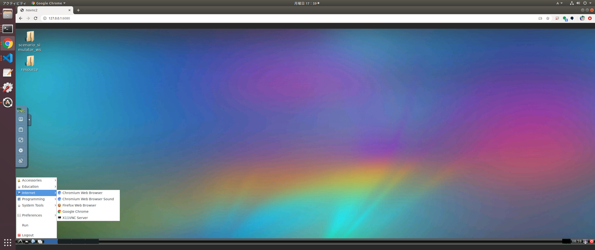

# How to use with scenario editor
Described in here.
docker image includes Google Chrome, so you can connect to scenario editor by clicking google chrome icon in the start menu.

[CreateSimpleScenario](CreateSimpleScenario.md)
[EditScenario](EditScenario.md)  
[ChangeCoordinate](ChangeCoordinate.md)  

Do not forget!! : Please export scenario in Tier4 format V2.

