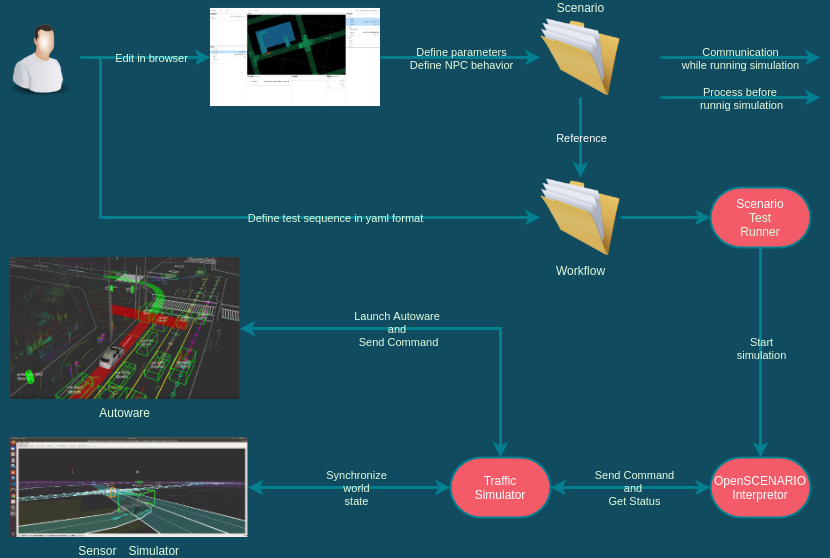

# Scenario simulator v2

Scenario simulator v2 is a scenario testing framework for Autoware.

It enables Autoware developers to write a scenario at once and run in various kinds of simulator.

## What can we do with this framework

Currently, various kinds of simulators and scenario formats are developed all over the world.
We need an open-source framework for integrating those testing tools with Autoware easily and quickly.
So, we are developing this package.
**This package is designed to easily accommodate multiple simulators and scenario description formats.**

This package is licensed under the Apache License, Version 2.0.
See also [LICENSE](https://github.com/tier4/scenario_simulator_v2/blob/master/LICENSE).

## Why this framework is v2?

This package re-designs the [scenario runner](https://github.com/tier4/scenario_runner.iv.universe) developed by [TIER IV, Inc.](https://tier4.jp/en/), so we named this framework as "scenario_simulator_v2"

## How to contribute

Please refer to the [contributor guidelines](developer_guide/CONTRIBUTING.md).
