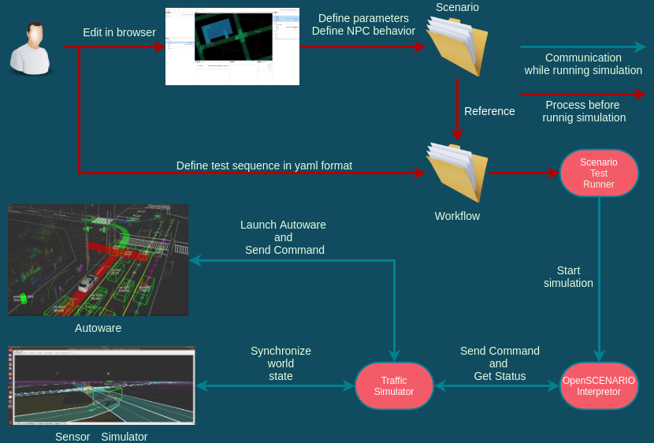

# Architecture Design

This documentation describes the architecture design of this scenario testing framework.

This framework is designed for executing scenario test with Autoware.  

__This framework is designed to easily accommodate multiple simulators and scenario description formats.__

## Simple sensor simulator
If you want to know about our very very simple lidar simulator, please read [this documentation](SimpleSensorSimulator.md).

## Traffic simulator
If you want to know how to control traffic in simulation, and how to develop your original scenario format, please read [this documentation](TrafficSimulator.md).

## Communication with simulator and interpreter
If you want to know how to connect your simulator with this testing framework, please read [this documentation](ZeroMQ.md).

## Autoware API
If you want to know how we can send command to the Autoware via simulator, please read [this documentation](AutowareAPI.md).

## Systen Architecture
If you want to know whole system architecture of this framework, please read [this documentation](SystemArchitecture.md).

## TierIV Scenario Format Version 2.0
If you want to know Tier IV Scenario format Ver 2.0 , which is a default scenario format of this framework, please read [this documentation](Tier4ScenarioFormatVersion2.md).
