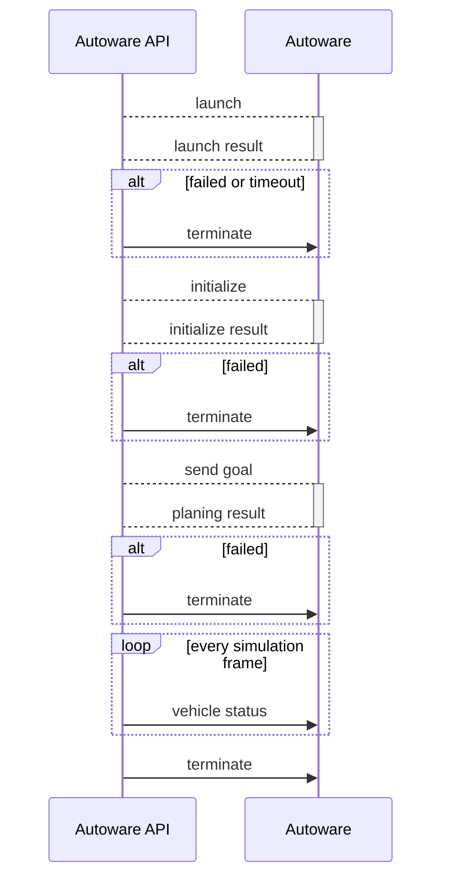

# Autoware API

Autoware API provides features to control autoware easily via ROS2 API.  
AWAPI accessor is a C++ wrapper of the Autoware API, and it enables us to integrate with Autoware and other tools very easily!  
We can control autoware while initialize_duration of the simulation. (current_time < 0)

*Note! Autoware API is now under development and we are preparing documentation about this. We provide source code, but it is not a final version.*

