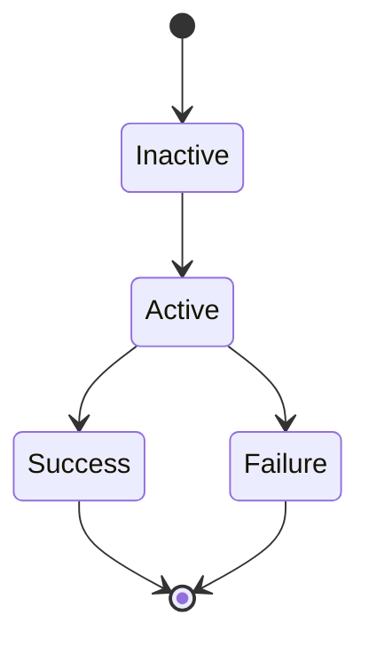

# Metrics

Metrics classs allow you to check Autoware way of driving is valid or not.

## Lifecycle

Each metrics has a lifecycle.


### Inactive
In this state, metrics class does not start calculating metrics.
If the activateTrigger function in each metrics class returns true, then the metrics moves to Active state.

### Active
In this state, metrics class calculate metrics and check the behavior of entity is good or not.
update function in metrics class was called in every simulation frame in this state.

### Success
In this state, metrics class does not calculate metrics any more.

### Failure
In this state, metrics class throw specification vaiolation error.

## What types of metrics can we use?

If you wnat to use metrics class with C++ API, all you have to do is call API::addMetric function.

```C++
api_.addMetric<T>("name of metric", "arguments for metric you want to check" ...);
```

### Traveled Distace
Class documentation is [here.](https://tier4.github.io/scenario_simulator_v2/package/traffic_simulator/markdown/Classes/classmetrics_1_1TraveledDistanceMetric/#public-functions)  
Traveled distance metric calculates total traveled distance for target entity.

### Momentary Stop

Class documentation is [here.](https://tier4.github.io/scenario_simulator_v2/package/traffic_simulator/markdown/Classes/classmetrics_1_1MomentaryStopMetric/)  
Momentary stop metric enable us to check the target entity can stop in front of the crosswalk / stop line.