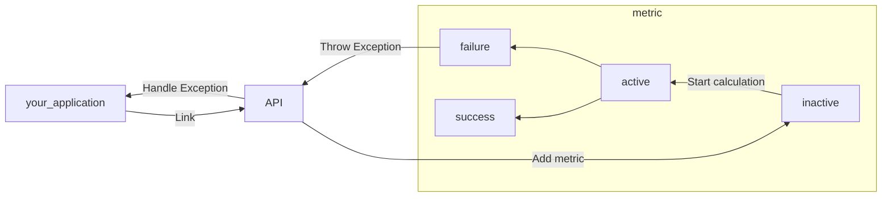
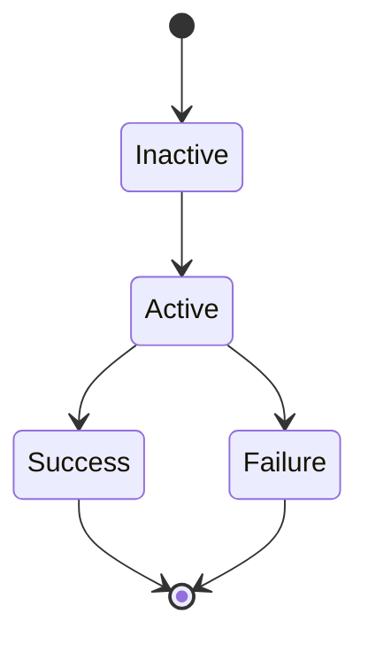

# Metrics

Metrics class allows you to check Autoware way of driving is valid or not.

## How it works



You can add a metric by using the API below,

```C++
api_.addMetric<T>("name of metric", "arguments for metric you want to check" ...);
```

If a metric detects a specification violation, then the metric moves to the Failure lifecycle and throws errors.  
Thrown exception should be handled by your application.

## Lifecycle

Each metric has a lifecycle.



### Inactive

In this state, metrics class does not start calculating metrics.
If the activateTrigger function in each metrics class returns true, then the metrics move to the Active state.

### Active

In this state, metrics class calculates metrics and checks the behavior of an entity is good or not.
update function in the metrics class is called in every simulation frame in this state.

### Success

In this state, metrics class does not calculate metrics anymore.

### Failure

In this state, metrics class throws a specification violation error.

## What types of metrics can we use?

If you want to use the metrics class with C++ APIs, all you have to do is call the `API::addMetric` function.

```C++
api_.addMetric<T>("name of metric", "arguments for metric you want to check" ...);
```

### Traveled Distance
[//]: # (TODO : Fix "here" link)
Class documentation is [here](https://tier4.github.io/scenario_simulator_v2/package/traffic_simulator/markdown/Classes/classmetrics_1_1TraveledDistanceMetric/#public-functions).  
Traveled distance metric calculates the total traveled distance for a target entity.

### Momentary Stop
[//]: # (TODO : Fix "here" link)
Class documentation is [here](https://tier4.github.io/scenario_simulator_v2/package/traffic_simulator/markdown/Classes/classmetrics_1_1MomentaryStopMetric/).  
Momentary stop metric enables us to check the target entity can stop in front of the crosswalk and stop line.

### Reaction Time
[//]: # (TODO : Fix "here" link)
Class documentation is [here](https://tier4.github.io/scenario_simulator_v2/package/traffic_simulator/markdown/Classes/classmetrics_1_1ReactionTimeMetric/).  
Reaction time metric enables us to check the target entity follows the front entity speed.

### Out of range
[//]: # (TODO : Fix "here" link)
Class documentation is [here](https://tier4.github.io/scenario_simulator_v2/package/traffic_simulator/markdown/Classes/classmetrics_1_1OutOfRangeMetric/).  
Out of range metric enables us to check the velocity, acceleration, jerk of a target entity are in the valid range or not.

### Standstill
[//]: # (TODO : Fix "here" link)
Class documentation is [here](https://tier4.github.io/scenario_simulator_v2/package/traffic_simulator/markdown/Classes/classmetrics_1_1StandstillMetric/).  
Standstill metric enables us to check an entity is stacked or not.
This metric checks the standstill duration of the target entity overs the allowed standstill duration.

### Collision
[//]: # (TODO : Fix "here" link)
Class documentation is [here](https://tier4.github.io/scenario_simulator_v2/package/traffic_simulator/markdown/Classes/classmetrics_1_1CollisionMetric/).
Collision metric checks the target entity is colliding with the other entity or not.
