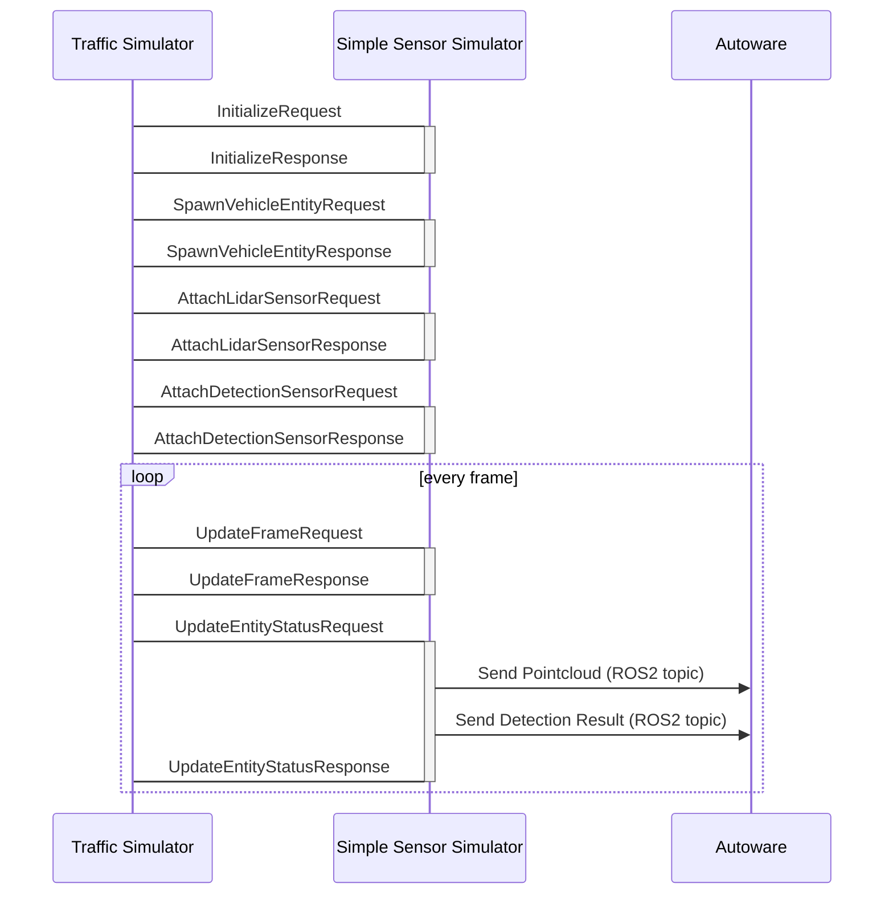

# Simple sensor simulator

The simple sensor simulator is a reference implementation of the simulator which follows our scenario testing framework.
This package includes very very simple lidar simulation and send simulated detection result to the Autoware.

## Sequence Diagram

## Required APIs to communicate with traffic simulator and sensor simulator
### Initialize
[InitializeRequest](https://tier4.github.io/scenario_simulator_v2/proto_doc/protobuf/#simulation_api_schema.InitializeRequest)  
[InitializeResponse](https://tier4.github.io/scenario_simulator_v2/proto_doc/protobuf/#simulation_api_schema.InitializeResponse)  

[UpdateFrameRequest](https://tier4.github.io/scenario_simulator_v2/proto_doc/protobuf/#simulation_api_schema.UpdateFrameRequest)  
[UpdateFrameResponse](https://tier4.github.io/scenario_simulator_v2/proto_doc/protobuf/#simulation_api_schema.UpdateFrameResponse)  
[UpdateSensorFrameRequest](https://tier4.github.io/scenario_simulator_v2/proto_doc/protobuf/#simulation_api_schema.UpdateSensorFrameRequest)  
[UpdateSensorFrameResponse](https://tier4.github.io/scenario_simulator_v2/proto_doc/protobuf/#simulation_api_schema.UpdateSensorFrameResponse)  

In lidar simulation, we use intel's ray-casting library embree.

<iframe 
  class="hatenablogcard" 
  style="width:100%;height:155px;max-width:450px;" 
  title="embree" 
  src="https://hatenablog-parts.com/embed?url=https://github.com/embree/embree" 
  width="300" height="150" frameborder="0" scrolling="no">
</iframe>

