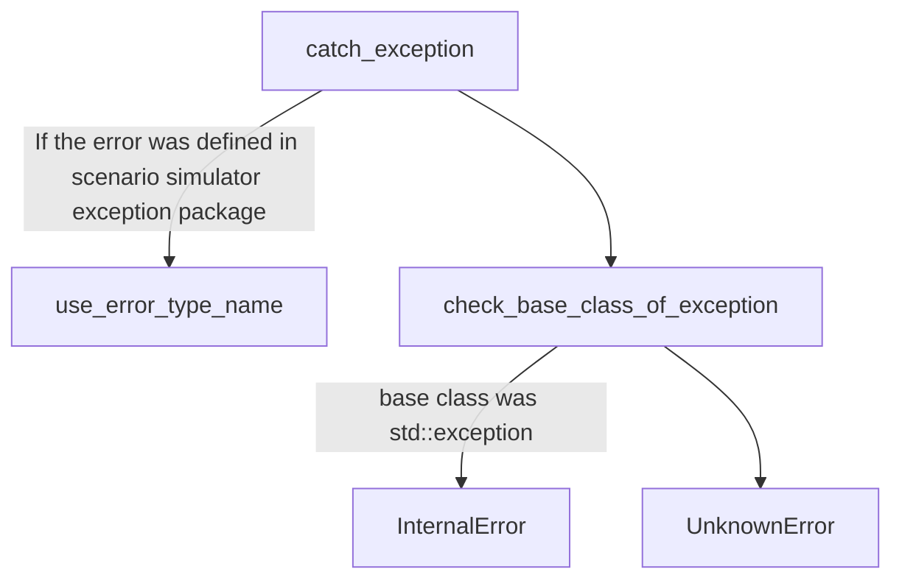

# Simulation Result Format
## File format
Result file should be in junit format.  
[This package](https://github.com/tier4/scenario_simulator_v2/tree/master/common/simple_junit) helps to output junit.
Example of result file is here.  

```xml
<?xml version="1.0"?>
<testsuites>
	<testsuite name="example_suite">
		<testcase name="example_case">
			<error type="InternalError" message="foo" />
			<failure type="Failure" message="Expected success" />
		</testcase>
	</testsuite>
	<testsuite name="example_suites" />
</testsuites>
```

This format is a Junit5 format.

### Test Case Result
#### Failure

Failure means the test cases was unexpected situation such as collision, stack etc...  
Message of the result should be

```xml
<failure type="Failure" message="Expected success" />
```

or

```xml
<failure type="Failure" message="Expected failure" />
```

or

```xml
<failure type="Failure" message="Expected error" />
```

#### Error

Error means the test cases was failed with error such as some Autoware node was downed, failed to launch Autoware etc..  
All errors was thrown as error from API class.
If you want to see example, please see also [this code](https://github.com/tier4/scenario_simulator_v2/blob/c6d7c4da7556a593dc3d34b0a982bc[…]r/include/openscenario_interpreter/openscenario_interpreter.hpp).  
XML of the error result should be

```xml
<error type="AutowareError" message="foo" />
```
or
```xml
<error type="AutowareError" message="foo" />
```

Message in xml is a string which comes from what() member function from exception instance.

#### Error Types
Each error types describe these meanings.
Flow chart of what message type should be use is here.



If you want to know all exception types defined in scenario simulator exception package, please look at [this code](https://github.com/tier4/scenario_simulator_v2/blob/master/common/scenario_simulator_exception/include/scenario_simulator_exception/exception.hpp) and [this document.](ErrorCategories.md)

## Usage of simple_junit

Sample codes are below.

```c++
#include <simple_junit/junit5.hpp>

int main()
{
  common::junit::JUnit5 junit;
  junit.testsuite("example_suites");
  common::junit::Error error_case("example_error", "error_test_case");
  junit.testsuite("example_suite").testcase("example_case").error.push_back(error_case);
  common::junit::Failure failure_case("example_failure", "failure_test_case");
  junit.testsuite("example_suite").testcase("example_case").failure.push_back(failure_case);
  junit.write_to("result.junit.xml");
}
```

If you run this code, result.junit.xml should be like below.

```xml
<?xml version="1.0"?>
<testsuites>
	<testsuite name="example_suite">
		<testcase name="example_case">
			<error type="example_error" message="error_test_case" />
			<failure type="example_failure" message="failure_test_case" />
		</testcase>
	</testsuite>
	<testsuite name="example_suites" />
</testsuites>
```

common::junit::JUnit5 class provides features to output result in junit format.  
common::junit::Error class describes the error output.  
common::junit::Failure class describes the failure output.  
