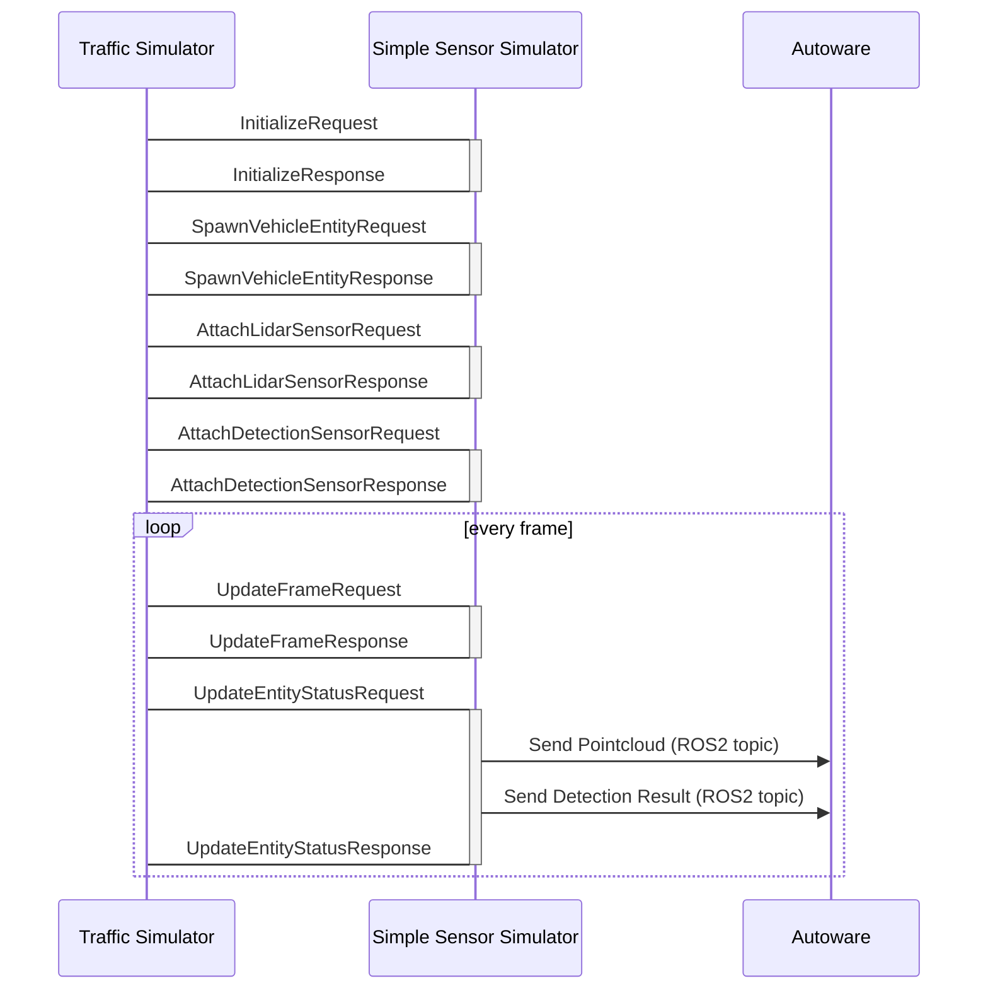

# Communication with simulator and interpreter

We use ZeroMQ Inter-Process communication with your simulator and traffic simulator.

*Note! Simple Sensor Simulator is just a reference implementation, so we can adapt any kinds of autonomous driving simulators if we can develop ZeroMQ interface to your simulator.*

## What is ZeroMQ
[ZeroMQ](https://zeromq.org/) is an open-source messaging library, it supports TCP/UDP/Intra-Process messaging communication.  
We use [ZeroMQ](https://zeromq.org/) in order to communicate with the simulator and interpreter.
We use Request/Reply socket in order to run the simulator synchronously.  

<iframe 
  class="hatenablogcard" 
  style="width:100%;height:155px;max-width:450px;" 
  title="embree" 
  src="https://hatenablog-parts.com/embed?url=https://zeromq.org/" 
  width="300" height="150" frameborder="0" scrolling="no">
</iframe>

## Sequence Diagram

Traffic simulator has a zeromq client and sensor simulator has a zeromq server.
We use protobuf in order to serialize data.

## Schema of the message
traffic_simulatorr::API send the request to the simulator, Requests are serialized by using [protobuf](https://developers.google.com/protocol-buffers) and use different port in order to communicate with the simulator.  

### Protobuf Definition
[Schema of Protobuf](https://github.com/tier4/scenario_simulator_v2/blob/master/simulation/simulation_interface/proto/simulation_api_schema.proto) is here.
[Protobuf Documentation](../proto_doc/protobuf.md) is here. all datas are serialized as string and send via TCP by using ZeroMQ.

## Required APIs for co-simulation

Traffic simulator and simple sensor simulator communicates with APIs below, if you want to integrate with your simulator, only you have to do is prepareing these APIs below.

| API                     | TCP Port | Request                                                                                                                                              | Response                                                                                                                                               |
| ----------------------- | -------- | ---------------------------------------------------------------------------------------------------------------------------------------------------- | ------------------------------------------------------------------------------------------------------------------------------------------------------ |
| initialize              | 5555     | [InitializeRequest](https://tier4.github.io/scenario_simulator_v2/proto_doc/protobuf/#simulation_api_schema.InitializeRequest)                       | [InitializeResponse](https://tier4.github.io/scenario_simulator_v2/proto_doc/protobuf/#simulation_api_schema.InitializeResponse)                       |
| update_frame            | 5556     | [UpdateFrameRequest](https://tier4.github.io/scenario_simulator_v2/proto_doc/protobuf/#simulation_api_schema.UpdateFrameRequest)                     | [UpdateFrameResponse](https://tier4.github.io/scenario_simulator_v2/proto_doc/protobuf/#simulation_api_schema.UpdateFrameResponse)                     |
| update_sensor_frame     | 5557     | [UpdateSensorFrameRequest](https://tier4.github.io/scenario_simulator_v2/proto_doc/protobuf/#simulation_api_schema.UpdateSensorFrameRequest)         | [UpdateSensorFrameResponse](https://tier4.github.io/scenario_simulator_v2/proto_doc/protobuf/#simulation_api_schema.UpdateSensorFrameResponse)         |
| spawn_vehicle_entity    | 5558     | [SpawnVehicleEntityRequest](https://tier4.github.io/scenario_simulator_v2/proto_doc/protobuf/#simulation_api_schema.SpawnVehicleEntityRequest)       | [SpawnVehicleEntityResponse](https://tier4.github.io/scenario_simulator_v2/proto_doc/protobuf/#simulation_api_schema.SpawnVehicleEntityResponse)       |
| spawn_pedestrian_entity | 5559     | [SpawnPedestrianEntityRequest](https://tier4.github.io/scenario_simulator_v2/proto_doc/protobuf/#simulation_api_schema.SpawnPedestrianEntityRequest) | [SpawnPedestrianEntityResponse](https://tier4.github.io/scenario_simulator_v2/proto_doc/protobuf/#simulation_api_schema.SpawnPedestrianEntityResponse) |
| despawn_entity          | 5560     | [DespawnEntityRequest](https://tier4.github.io/scenario_simulator_v2/proto_doc/protobuf/#simulation_api_schema.DespawnEntityRequest)                 | [DespawnEntityResponse](https://tier4.github.io/scenario_simulator_v2/proto_doc/protobuf/#simulation_api_schema.DespawnEntityResponse)                 |
| update_entity_status    | 5561     | [UpdateEntityStatusRequest](https://tier4.github.io/scenario_simulator_v2/proto_doc/protobuf/#simulation_api_schema.UpdateEntityStatusRequest)       | [UpdateEntityStatusResponse](https://tier4.github.io/scenario_simulator_v2/proto_doc/protobuf/#simulation_api_schema.UpdateEntityStatusResponse)       |
| attach_lidar_sensor     | 5562     | [AttachLidarSensorRequest](https://tier4.github.io/scenario_simulator_v2/proto_doc/protobuf/#simulation_api_schema.AttachLidarSensorRequest)         | [AttachLidarSensorResponse](https://tier4.github.io/scenario_simulator_v2/proto_doc/protobuf/#simulation_api_schema.AttachLidarSensorResponse)         |
| attach_detection_sensor | 5563     | [AttachDetectionSensorRequest](https://tier4.github.io/scenario_simulator_v2/proto_doc/protobuf/#simulation_api_schema.AttachDetectionSensorRequest) | [AttachDetectionSensorResponse](https://tier4.github.io/scenario_simulator_v2/proto_doc/protobuf/#simulation_api_schema.AttachDetectionSensorResponse) |
