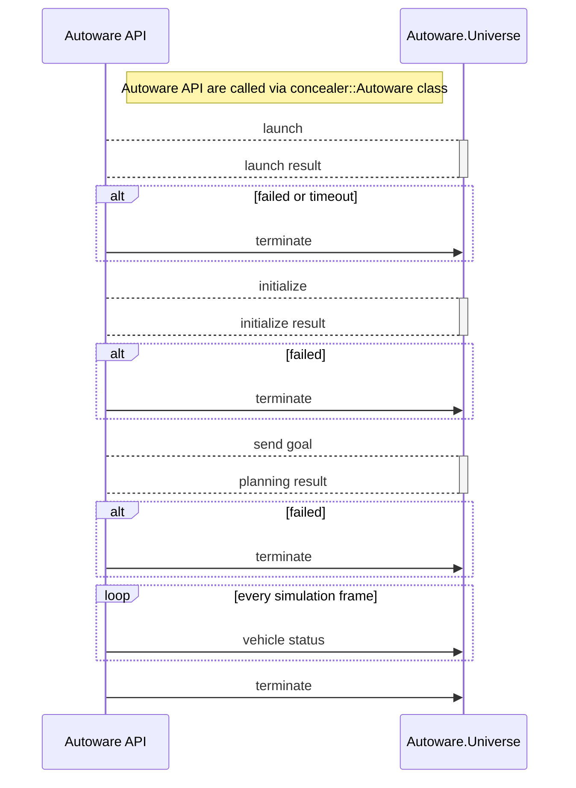

# Autoware API

scenario_simulator_v2 can control Autoware via Autoware API.  
Autoware API is designed for integrating Autoware with other tools such as scenario_simulator_v2!  
In scenario_simulator_v2, we implemented C++ wrapper of Autoware API in `concealer::Autoware` class.  
All action commands to the ego vehicle controlled by Autoware are done through this wrapper class.  
The details of the Autoware API are described in [the Autoware interface design page](https://autowarefoundation.github.io/autoware-documentation/main/design/autoware-architecture-v1/interfaces/).  

[//]: # (*Note! Autoware APIs are now under development, and we are preparing documentation about this. The current code is not a final version, might be changed in the future.*)
!!! note
    Our `concealer::Autoware` only supports Autoware.Universe.

Before we start simulation, scenario_simulator_v2 initialize Autoware via API like below.
scenario_simulator_v2 waits until these initialization processes to complete and starts SimulationTime as soon as the Engage command is sent to Autoware.

