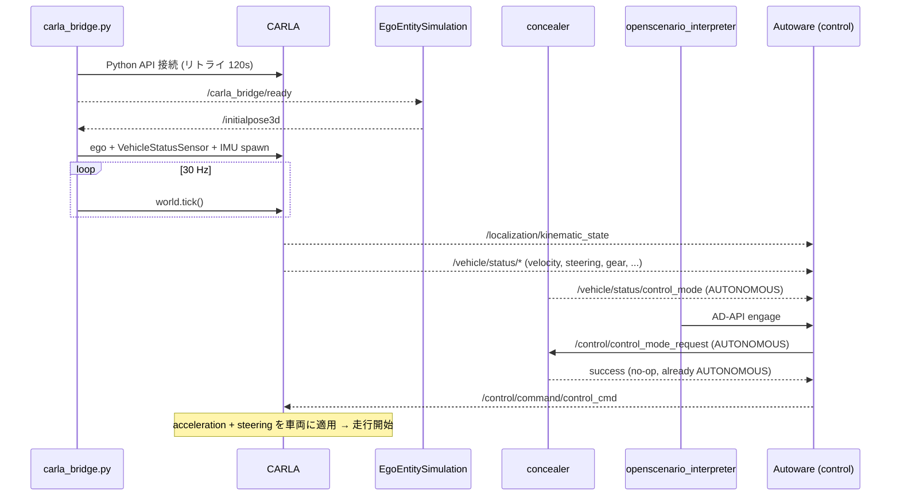

# CARLA External Simulator 連携ガイド

## 概要

`scenario_simulator_v2` (SSv2) は `VehicleModelType::EXTERNAL` モードで **CARLA (odaiba-carla)** を ego 車両の物理シミュレータとして利用する。

3 つのコンポーネントが役割を分担する:

| コンポーネント | 役割 |
|---|---|
| **CARLA** (in-engine ROS 2 bridge) | 車両物理・localization・vehicle status の publish、制御コマンドの受信 |
| **carla_bridge.py** | CARLA の lifecycle 管理（接続・ego spawn・world tick） |
| **concealer** (SSv2) | `/vehicle/status/control_mode` の publish と mode 変更 service |

## トピック責務一覧

Autoware が必要とするトピックと、CARLA モードでの配信元。

### → Autoware へ publish するトピック

| トピック | 通常 | CARLA モード | 備考 |
|---|---|---|---|
| `/localization/kinematic_state` | concealer | CARLA (AutowareLocalizationPublisher) | |
| `/localization/acceleration` | concealer | CARLA (AutowareLocalizationPublisher) | |
| `/tf` (map → base_link) | concealer | CARLA (AutowareLocalizationPublisher) | |
| `/vehicle/status/velocity_status` | concealer | CARLA (AutowarePublisher) | |
| `/vehicle/status/steering_status` | concealer | CARLA (AutowarePublisher) | |
| `/vehicle/status/gear_status` | concealer | CARLA (AutowarePublisher) | |
| `/vehicle/status/turn_indicators_status` | concealer | CARLA (AutowarePublisher) | cmd echo → light state fallback |
| `/vehicle/status/hazard_lights_status` | concealer | CARLA (AutowarePublisher) | cmd echo → light state fallback |
| `/vehicle/status/control_mode` | concealer | concealer | AUTONOMOUS 固定 |
| `/sensing/imu/imu_data` | IMU driver | CARLA (IMU sensor) | frame: `tamagawa/imu_link` |

### ← Autoware から subscribe するトピック

| トピック | 通常 | CARLA モード | 備考 |
|---|---|---|---|
| `/control/command/control_cmd` | concealer | CARLA (AutowareController) | accel + steer を車両に適用 |
| `/control/command/turn_indicators_cmd` | concealer | CARLA (AutowareController) | status echo 用に PeekMessage |
| `/control/command/hazard_lights_cmd` | concealer | CARLA (AutowareController) | status echo 用に PeekMessage |
| `/control/command/gear_cmd` | concealer | CARLA (AutowareController) | 受信するが未使用 (TODO) |
| `/control/command/emergency_cmd` | concealer | CARLA (AutowareController) | 受信するが未使用 (TODO) |
| `/vehicle/engage` | concealer | CARLA (AutowareController) | 受信するが未使用 (TODO) |

### SSv2 ↔ carla_bridge ハンドシェイク

| トピック | 通常 | CARLA モード | 備考 |
|---|---|---|---|
| `/carla_bridge/ready` | — | carla_bridge → SSv2 | CARLA 接続完了通知 (TRANSIENT_LOCAL) |
| `/initialpose3d` | — | SSv2 → carla_bridge | ego spawn トリガー (TRANSIENT_LOCAL) |

### Service

| Service | 通常 | CARLA モード | 備考 |
|---|---|---|---|
| `/control/control_mode_request` | concealer | concealer | |

## 起動シーケンス

---

## 詳細: コンポーネント別

### carla_bridge.py

ROS 2 トピックの publish は `/carla_bridge/ready` のみ。それ以外は全て CARLA または concealer が担当する。

| 責務 | 詳細 |
|---|---|
| CARLA 接続 | Python API、120s リトライ、毎回 `carla.Client()` を再生成 |
| sync mode 設定 | 30 Hz 固定ステップ |
| ego spawn | `/initialpose3d` 受信 → 車両 + VehicleStatusSensor + IMU をスポーン |
| world tick | sync mode では外部からの `world.tick()` が必須 |
| spectator 追従 | ego 後方からのカメラ視点 |
| shutdown | actor 破棄 + async mode 復元 |

### CARLA in-engine ROS 2 bridge

vehicle status と localization を publish し、制御コマンドを subscribe する。

- **localization**: `publish_autoware_localization_ground_truth: "true"` を VehicleStatusSensor の attribute に設定すると有効化される。変換定数は carla_bridge.py の `VEHICLE_STATUS_ATTRS` 経由で渡される
- **control_mode**: CARLA は publish しない。concealer が担当する

### concealer

`/vehicle/status/control_mode` の publish と `/control/control_mode_request` service を提供する。CARLA モードでも有効のまま残る唯一の concealer 機能。

## 詳細: 座標変換

CARLA と Autoware は異なる座標系を使用する。変換定数は carla_bridge.py と CARLA の `VehicleStatusSensor.cpp` で同一の値が定義されている。

| 定数 | 用途 |
|---|---|
| `REFERENCE_MAP_X/Y/Z` | Autoware map frame のアンカー点 |
| `REFERENCE_CARLA_BASE_X/Y/Z` | CARLA world のアンカー点 |
| `MAP_TO_CARLA_SCALE` | スケール係数 |
| `MAP_TO_CARLA_XY_YAW_RAD`, `MAP_TO_CARLA_YAW_RAD` | 回転補正 |

carla_bridge.py は spawn 時の map → CARLA 変換にのみ使用する。localization の CARLA → map 変換は CARLA 内部の `AutowareLocalizationPublisher` が行う。

## 詳細: Godot 統合との違い

| 項目 | Godot | CARLA |
|---|---|---|
| 通信方式 | WebSocket (rosbridge) | CycloneDDS + Python API |
| ready シグナル | `/localization/kinematic_state` 初受信 | `/carla_bridge/ready` |
| localization | Godot が publish | CARLA が publish |
| control_mode | Godot が publish | concealer が publish |
| engage relay | 必要 | 不要 |
| world tick | Godot 自身が駆動 | carla_bridge.py が駆動 |
