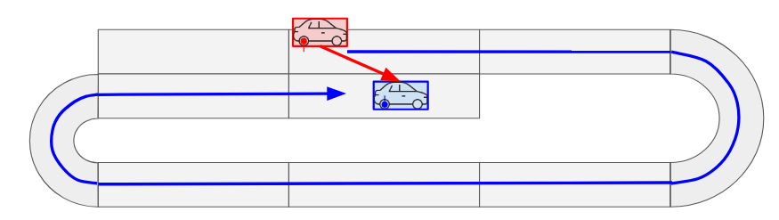
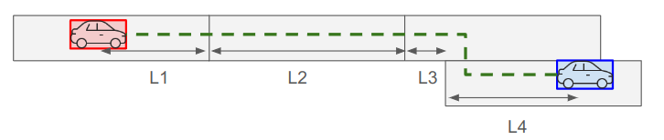
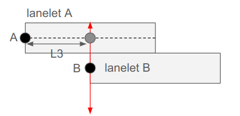
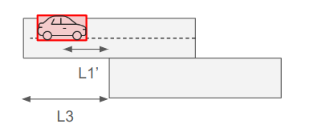

# Distance Calculation

You can use distance evaluation in the scenario via `DistanceCondition` and `RelativeDistanceCondition`.  
The calculation algorithm used for distance can be controlled by `RoutingAlgorithm`.  
This document explains the algorithm that have already implemented.

## `RoutingAlgorithm::undefined` in lane coordinate system

The old implementation is used as-is.  
Please see [this document](lane_pose_calculation/GetLongitudinalDistance.md) for details.  
This implementation has limitations such as not being able to route to locations where lane changes are required.  
In the internal implementation, lanelet2's shortestPath is used as the algorithm.  

Although it works well in many cases, it returns unexpected results in corner cases such as the following.  



## `RoutingAlgorithm::shortest` in lane coordinate system

With `RoutingAlgorithm::shortest`, you can use the route with lane changes to measure distances on lane coordinate.
In the internal implementation, lanelet2's shortestPath is used as the algorithm.

It is complex to calculate the longitudinal distance along the route with lane changes.
The image below is a typical example of longitudinal distance measurement including a lane change.
Here, the longitudinal distance from the red car to the blue car is calculated by the sum of L1 to L4.
We will look at how `RoutingAlgorithm::shortest` implementation calculate the longitudinal distance through each calculation method.




#### L1: first lanelet

```
L1 = (length of first lanelet) - (s value of red car)
```

#### L2: normal intermediate lanelet

```
L2 = (length of lanelet)
```

#### L3: the lanelet before the lane change

`A`: the origin of lane coordinate system of lanelet A  
`B`: the origin of lane coordinate system of lanelet B  

Here, let `A'` and `B'` below.  
`A'`: the representation of `A` in the lane coordinate system of lanelet B  
`B'`: the representation of `B` in the lane coordinate system of lanelet A  

And L3 is calculated as below.
``` 
if B' is valid:
    L3 = B'.s
else:
   if A' is valid:
     L3 = -A'.s
   else:
     L3 is undefined  
```
  
The image below shows how to calculate s value of `B'`.
First, the algorithm try to match `B` to lanelet A by calculating the collision point of horizontal bar and lanelet A center line.
Then, let the longitudinal distance between `A` and the collision point as `B'`.s.




#### L4: the last lanelet

```
L4 = (s value of blue car)
```

#### Appendix: first lanelet before the lane change



```
L1' = L3 - (s value of red car)
```
