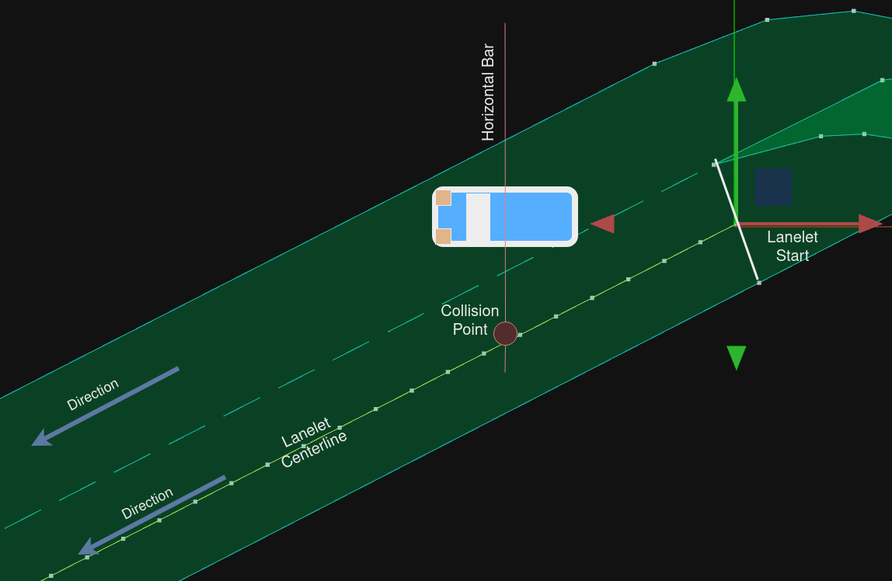

# Distance Calculation

You can use distance evaluation in the scenario via `DistanceCondition` and `RelativeDistanceCondition`.  
The calculation algorithm used for distance can be controlled by `RoutingAlgorithm`.  
This document explains the algorithm that have already implemented.

## `RoutingAlgorithm::undefined` in lane coordinate system

The old implementation is used as-is.  
Please see [this document](lane_pose_calculation/GetLongitudinalDistance.md) for details.  
This implementation has limitations such as not being able to route to locations where lane changes are required.  
In the internal implementation, lanelet2's shortestPath is used as the algorithm.  

Although it works well in many cases, it returns unexpected results in corner cases such as the following.  


## `RoutingAlgorithm::shortest` in lane coordinate system

With `RoutingAlgorithm::shortest`, you can use the route with lane changes to measure distances on lane coordinate.
In the internal implementation, lanelet2's shortestPath is used as the algorithm.

The image below is a typical example of longitudinal distance measurement including a lane change.


#### Without lane change
For cases without any lane change it is enough to sum up every lanelets' length and then subtract:
- distance traveled on the first lanelet (start of the first lanelet to the red car),
- distance remaining on the last lanelet (blue car to the end of the last lanelet). This step is equivalent with discarding the last lanelet length and then adding distance traveled on the last lanelet (start of the last lanelet to the blue car),

#### With lane change
For routes that include lane changes we do the exact same thing, except for the lanelet just before the lane change (lanelet including L3 segment):
- its length is not added, because this part would be counted twice,
- we calculate and add L3 (explained in `Calculation of the lane_change distance`).

#### Pseudocode
```
route = getRoute(source_lanelet_id, target_lanelet_id)
discard last element in route
distance = 0
for_each lanelet_id in route:
  if lanelet_id is a lanelet just before the lane change:
    calculate lane_change distance 
    distance += lane_change distance
  else:
    distance += lanelet_id length
distance -= distance traveled on the first lanelet
distance += distance traveled on the last lanelet
return distance 
```

#### Calculation of the lane_change distance

- `'start'` of each lanelet is equal to 0. This represents a position at `s_value = 0`
- `'mid'` of each lanelet is equal to `0.5 * min(current_lanelet_length, next_lanelet_length)`. This will give us an additional position to match if starting positions fail.
- `Current_start`: position of the `'start'` of the current lanelet (`s_value = 0`).
- `Next_start`: position of the `'start'` of the next lanelet (`s_value = 0`).
- `Current_mid`: position of the `'mid'` of the current lanelet (`s_value = 'mid'`).
- `Next_mid`: position of the `'mid'` of the next lanelet (`s_value = 'mid'`).

How lane change distance is calculated:
``` 
if `Next_start` can be matched to the current lanelet:
  distance += distance from the `'start'` of the current lanelet to the matching position
elif `Current_start` can be matched to the next lanelet:
  distance -= distance from the `'start'` of the next lanelet to the matching position
if `Next_mid` can be matched to the current lanelet:
  distance += distance from the `'mid'` of the current lanelet to the matching position
elif `Current_mid` can be matched to the next lanelet:
  distance -= distance from the `'mid'` of the next lanelet to the matching position
else:
  distance is undefined  
```

#### Matching a position to a lanelet

1. From a position (which includes an orientation) a horizontal bar is defined.
2. Then target lanelet's centerline is checked for a collision with the horizontal bar.
3. The collision point is defined as the matching position
