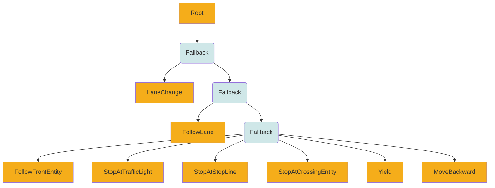

# Entity Behavior

Behavior logic of the entity is pluggable.
If you want to use your own behavior, please see [this document](BehaviorPlugin.md).

In this document, we describe how default behavior tree entity works in traffic environment.
Default behavior tree entity behavior logics are in [this package](https://github.com/tier4/scenario_simulator_v2/tree/master/simulation/behavior_tree_plugin).

## Vehicle entity (with Behavior-Tree Plugin)

Behavior tree of vehicle entity is here.

| Action               | Behavior                                            | Success                                               | Failure                                                                                 |
|----------------------|-----------------------------------------------------|-------------------------------------------------------|-----------------------------------------------------------------------------------------|
| LaneChange           | Changing to target lane.                            | Moved to target lane.                                 | Failed to calculate lane change trajectory.                                             |
| FollowLane           | Following lane and moving to goal.                  |                                                       | Lane change was requested, traffic light, stop sing, conflicting entities are detected. |
| FollowFrontEntity    | Following target entity in front of the entity.     | Target entity was disappeared in front of the entity. |                                                                                         |
| StopAtTrafficLight   | Stopping at a traffic light until it becomes green. | The traffic light become green.                       |                                                                                         |
| StopAtStopLine       | Stopping at a stop line.                            | The entity was stopped at stop line.                  | Overrun stop line.                                                                      |
| StopAtCrossingEntity | Stopping at crossing entity.                        | Target entity was crossed.                            |                                                                                         |
| Yield                | Yield to right-of-way entity.                       | Right of way entity is moved.                         |                                                                                         |
| MoveBackward         | Move backward on lane.                              | Another request and new goal point was suggested.     |                                                                                         |

### Behavior
#### LaneChange

By using `API::requestLaneChange` function, you send lane change request to target entity.
You can send request with these parameters.

##### Target

| Value          | Meaning                                                                                                 |
|----------------|---------------------------------------------------------------------------------------------------------|
| AbsoluteTarget | Changing lanes to the exact target lanelet. You have to specify `lanelet_id`, `offset`                  |
| RelativeTarget | Changing lanes to the relative target lanelet. You have to specify `entity_name`, `shift`, `direction`. |

###### AbsoluteTarget

| Value      | Meaning                                          | Default |
|------------|--------------------------------------------------|---------|
| lanelet_id | Lanelet id, which you want to changing lanes to. |         |
| offset     | Target offset you want to changing lanes.        | 0       |

`offset` value is calculated under lane coordinate.

###### RelativeTarget

| Value       | Meaning                                             | Default |
|-------------|-----------------------------------------------------|---------|
| entity_name | Reference entity name.                              |         |
| shift       | Number of lanes counted from reference entity name. | 0       |
| offset      | Target offset you want to changing lanes.           | 0       |

##### TrajectoryShape

| Value  | Meaning                                      | Default            |
|--------|----------------------------------------------|--------------------|
| CUBIC  | Changing lanes with cubic spline trajectory. | :heavy_check_mark: |
| LINEAR | Changing lanes with linear trajectory.       |                    |

###### Cubic Trajectory Shape

<iframe
    src="https://user-images.githubusercontent.com/10348912/149456861-5e0e86e4-9063-4b59-94cc-bbed37c4b133.mp4"
    title="Install Docker Engine"
    class="embed-card embed-webcard"
    scrolling="no"
    frameborder="0"
    style="display: block; width: 100%; height: 300px; max-width: 500px; margin: 10px 0px;">
</iframe>

###### Linear Trajectory Shape

<iframe
    src="https://user-images.githubusercontent.com/10348912/149457026-0d3a7538-0cfc-4245-930f-eccc80d53e1c.mp4"
    title="Install Docker Engine"
    class="embed-card embed-webcard"
    scrolling="no"
    frameborder="0"
    style="display: block; width: 100%; height: 300px; max-width: 500px; margin: 10px 0px;">
</iframe>

##### Constraint

| Value                 | Meaning                                           | Default            |
|-----------------------|---------------------------------------------------|--------------------|
| NONE                  | Just changing lanes if possible.                  | :heavy_check_mark: |
| LATERAL_VELOCITY      | Changing lanes with target lateral velocity.      |                    |
| LONGITUDINAL_DISTANCE | Changing lanes with target longitudinal distance. |                    |
| TIME                  | Changing lanes with target duration.              |                    |

##### Policy

| Value       | Meaning                                                                     | Default            |
|-------------|-----------------------------------------------------------------------------|--------------------|
| FORCE       | Changing lanes and fulfilling constraints ignoring dynamics.                | :heavy_check_mark: |
| BEST_EFFORT | Changing lanes and trying to fulfill constraints without ignoring dynamics. |                    |

## Vehicle NPC (Do-Nothing Plugin)

When this plug-in is used, Entity can only be moved by specifying its pose, velocity, acceleration, jerk, etc. via the setEntityStatus function, etc.
When using this plug-in, any consistency in physical behavior is ignored.
Changes in posture, velocity, acceleration, and jerk over time will not occur.
The EntityStatus value will continue to be the value specified and updated via the setEntityStatus function, etc.
This plug-in was developed primarily to drive the simulator from Autoware rosbag data.  

