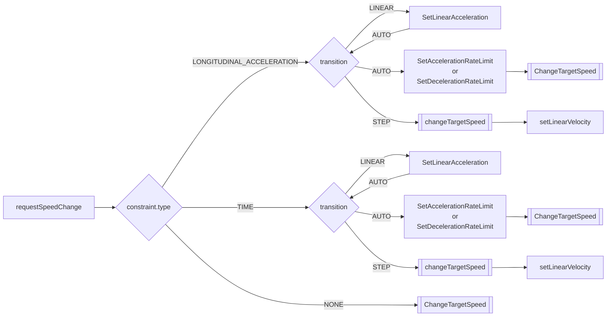
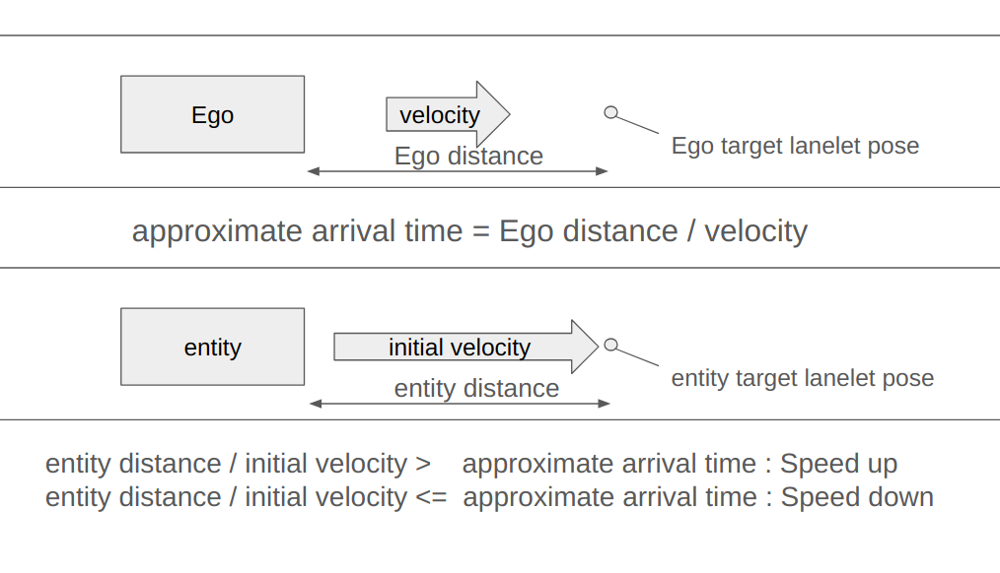

# Longitudinal Control

traffic_simulator has various ways to control the longitudinal behavior of the entity.

## Basic Information
### target_speed
In this document, you will see variant called `target_speed` which is the target speed of the entity. The entity will always try to reach the target speed under the constraints such as acceleration or deceleration set by the user or if not by the default value. If `target_speed` is `NULL`, the entity will keep or change the speed with some other constraints set by the user or if not by the default value.

### Set functions
Set functions directly changes the speed, acceleration, or deceleration of the entity. This will be executed immediately, even while the entity is trying to reach the target speed. It will ignore the physics of the entity and set the value directly.

## List of Longitudinal Controllers

| Name                                                      | Description                                     |
| --------------------------------------------------------- | ----------------------------------------------- |
| [**requestSpeedChange**](#requestSpeedChange)             | Changes the speed of the entity.                |
| [**requestSynchronize**](#requestSynchronize)             | Synchronizes the entity with the target entity. |
| [**setLinearVelocity**](#setLinearVelocity)               | Sets the linear velocity of the entity.         |
| [**setTwist**](#setTwist)                                 | Sets the twist of the entity.                   |
| [**setAcceleration**](#setAcceleration)                   | Sets the acceleration of the entity.            |
| [**setAccelerationLimit**](#setAccelerationLimit)         | Sets the acceleration limit of the entity.      |
| [**setAccelerationRateLimit**](#setAccelerationRateLimit) | Sets the acceleration rate limit of the entity. |
| [**setDecelerationLimit**](#setDecelerationLimit)         | Sets the deceleration limit of the entity.      |
| [**setDecelerationRateLimit**](#setDecelerationRateLimit) | Sets the deceleration rate limit of the entity. |
| [**setVelocityLimit**](#setVelocityLimit)                 | Sets the velocity limit of the entity.          |

## Details
### requestSpeedChange
By using `API::requestSpeedChange`, you can change the speed of the entity.
MiscObjectEntity can not be controlled by this API.
For EgoEntity, speed can only be changed before the simulation starts.
API takes several types of value sets. Description of each type is as follows.

#### Values
| Value        | Type   | Description                                                    |
| ------------ | ------ | -------------------------------------------------------------- |
| name         | string | Name of the entity.                                            |
| target_speed | double | Target speed of the entity.                                    |
| continuous   | bool   | If true the entity will keep the speed until the next command. |

The function will change entities `target_speed` to given immediately.
If `continuous` is set to `false`, job to accelerate to target speed will be deleted after the velocity has reached the target speed. If set to `true`, the entity will keep the speed until the next longitudinal control command ordered. It will accelerate on maximum acceleration rate set previously.

#### Values
| Value        | Type                     | Description                                                    |
| ------------ | ------------------------ | -------------------------------------------------------------- |
| name         | string                   | Name of the entity.                                            |
| target_speed | double                   | Target speed of the entity.                                    |
| transition   | speed_change::Transition | Transition type.                                               |
| constraint   | speed_change::Constraint | Constraint type.                                               |
| continuous   | bool                     | If true the entity will keep the speed until the next command. |

If `continuous` is set to `false`, job to accelerate to target speed will be deleted after the velocity has reached the target speed. If set to `true`, the entity will keep the speed until the next longitudinal control command ordered.

##### Longitudinal Acceleration
When `constraint.type` is set to `LONGITUDINAL_ACCELERATION`, the entity will accelerate to the target speed with acceleration of `constraint.value`.
- If `transition` is set to `LINEAR`, the entity will accelerate to the target speed linearly.
- If `transition` is set to `AUTO`, it will change the maximum acceleration speed of the entity and append the job to change the target speed of the entity to the job queue. After the entity reaches the target speed, it will change the maximum acceleration speed back to the original value.
- If `transition` is set to `STEP`, it will change the speed of the entity to the target speed immediately. It will ignore the acceleration rate set by the user.

##### Time Constraint Acceleration
When `constraint.type` is set to `TIME`, the entity will accelerate to the target speed by the time of `constraint.value`.
For `transition` it is the same as `LONGITUDINAL_ACCELERATION`.

##### None Constraint Acceleration
When `constraint` is set to `NONE`, is will append the job to change the target_speed of the entity to the job queue.

#### Values
By using `speed_change::RelativeTargetSpeed` you can set the target speed of the entity relative to another entity.
| Value        | Type                              | Description                                                    |
| ------------ | --------------------------------- | -------------------------------------------------------------- |
| name         | string                            | Name of the entity.                                            |
| target_speed | speed_change::RelativeTargetSpeed | Relative target speed.                                         |
| continuous   | bool                              | If true the entity will keep the speed until the next command. |

If `continuous` is set to `false`, job to accelerate to target speed will be deleted after the velocity has reached the target speed. If set to `true`, the entity will keep the speed until the next longitudinal control command ordered.

`target_speed.reference_entity_name` is the name of the entity that the target speed is relative to. The target speed of the entity will be same as the target speed of the reference entity.
- By setting `target_speed.type` to `DELTA`, you can set the target speed of the entity to be the target speed of the reference entity plus the value of `target_speed.value`.
- By setting `target_speed.type` to `FACTOR`, you can set the target speed of the entity to be the target speed of the reference entity multiplied by the value of `target_speed.value`.

#### Values
By using `speed_change::RelativeTargetSpeed` you can set the target speed of the entity relative to another entity.
| Value        | Type                              | Description                                                    |
| ------------ | --------------------------------- | -------------------------------------------------------------- |
| name         | string                            | Name of the entity.                                            |
| target_speed | speed_change::RelativeTargetSpeed | Relative target speed.                                         |
| transition   | speed_change::Transition          | Transition type.                                               |
| constraint   | speed_change::Constraint          | Constraint type.                                               |
| continuous   | bool                              | If true the entity will keep the speed until the next command. |
It works the same as explained before.

### requestSynchronize
By using `API::requestSynchronize`, you can request the entity to adjust speed to stop at the designated lanelet by the time target entity crosses the another designated lanelet.

| Value            | Description                                                            |
| ---------------- | ---------------------------------------------------------------------- |
| name             | Name of the entity.                                                    |
| target_name      | Name of the target entity.                                             |
| target_sync_pose | Target lanelet pose for target entity.                                 |
| entity_target    | Target lanelet pose for controlling entity.                            |
| target_speed     | Target speed for controlling entity (meter per second).                |
| tolerance        | Tolerance for how much margin to accept to stop at the target (meter). |

As shown in the image, the entity will adjust it's speed to `target_speed` on `entity_target` at the time the target entity crosses the `target_sync_pose`. `tolerance` is the margin of error for the entity to stop at the `entity_target`. The target entity could be set by giving the name of the entity as `target_name`.

### setLinearVelocity
By using `API::setLinearVelocity`, you can set the linear velocity of the entity immediately. It will ignore the physics of the entity and set the value directly.

| Value           | Type   | Description                    |
| --------------- | ------ | ------------------------------ |
| name            | string | Name of the entity.            |
| linear_velocity | double | Linear velocity of the entity. |

### setTwist
By using `API::setTwist`, you can set the twist of the entity immediately. It will ignore the physics of the entity and set the value directly.

| Value | Type                      | Description          |
| ----- | ------------------------- | -------------------- |
| name  | string                    | Name of the entity.  |
| twist | geometry_msgs::msg::Twist | Twist of the entity. |

### setAcceleration

By using `API::setAcceleration`, you can set the acceleration of the entity immediately. It will ignore the physics of the entity and set the value directly.

| Value        | Type                      | Description                 |
| ------------ | ------------------------- | --------------------------- |
| name         | string                    | Name of the entity.         |
| acceleration | geometry_msgs::msg::Accel | Acceleration of the entity. |

### setAccelerationLimit

By using `API::setAccelerationLimit`, you can set the acceleration limit of the entity immediately.

| Value        | Type   | Description                       |
| ------------ | ------ | --------------------------------- |
| name         | string | Name of the entity.               |
| acceleration | double | Acceleration limit of the entity. |

### setAccelerationRateLimit

By using `API::setAccelerationRateLimit`, you can set the acceleration rate limit of the entity immediately.

| Value             | Type   | Description                            |
| ----------------- | ------ | -------------------------------------- |
| name              | string | Name of the entity.                    |
| acceleration_rate | double | Acceleration rate limit of the entity. |

### setDecelerationLimit

By using `API::setDecelerationLimit`, you can set the deceleration limit of the entity immediately.

| Value        | Type   | Description                       |
| ------------ | ------ | --------------------------------- |
| name         | string | Name of the entity.               |
| deceleration | double | Deceleration limit of the entity. |

### setDecelerationRateLimit

By using `API::setDecelerationRateLimit`, you can set the deceleration rate limit of the entity immediately.

| Value             | Type   | Description                            |
| ----------------- | ------ | -------------------------------------- |
| name              | string | Name of the entity.                    |
| deceleration_rate | double | Deceleration rate limit of the entity. |

### setVelocityLimit

By using `API::setVelocityLimit`, you can set the velocity limit of the entity immediately.

| Value           | Type   | Description                   |
| --------------- | ------ | ----------------------------- |
| name            | string | Name of the entity.           |
| linear_velocity | double | Velocity limit of the entity. |
