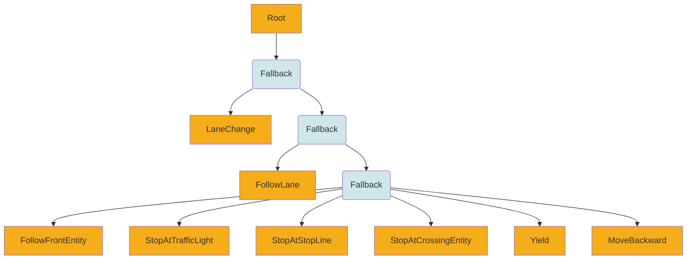
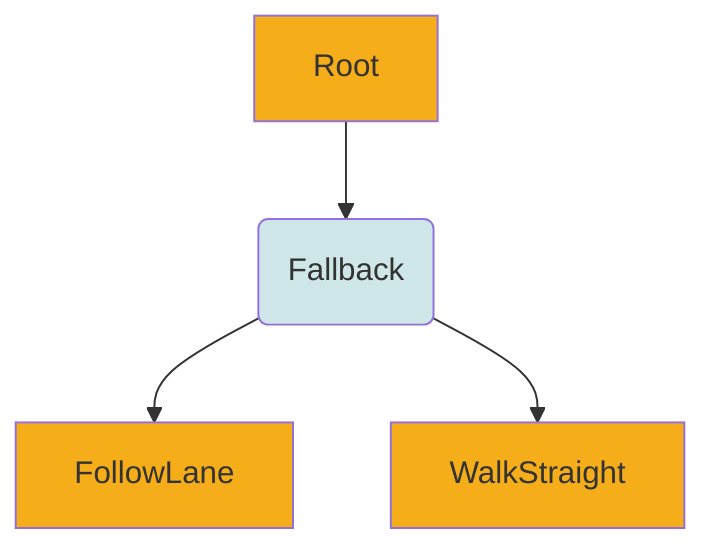

# NPC Behavior

Behavior logic of the NPC(non-player-character) is pluggable.
If you want to use your own behavior, please see [this document](BehaviorPlugin.md).

In this document, we describe how default behavior tree NPC works in traffic environment.
Default behavior tree NPC logics are in [this package](https://github.com/tier4/scenario_simulator_v2/tree/master/simulation/behavior_tree_plugin).

## List of behaviors

If you want to check detail, please check documents below.

| Entity \ Behavior | Behavior-Tree                                  | Do-Nothing                                  |
|-------------------|------------------------------------------------|---------------------------------------------|
| Vehicle           | [document](#vehicle-npc-with-behavior-tree)    | [document](#vehicle-npc-with-do-nothing)    |
| Pedestrian        | [document](#pedestrian-npc-with-behavior-tree) | [document](#pedestrian-npc-with-do-nothing) |
| MiscObject        | Does not exist.                                | Does not exist.                             |

## Vehicle NPC (with Behavior-Tree)
Behavior tree of vehicle NPC is here.



| Action               | Behavior                                            | Success                                            | Failure                                                                                 |
|----------------------|-----------------------------------------------------|----------------------------------------------------|-----------------------------------------------------------------------------------------|
| LaneChange           | Changing to target lane.                            | Moved to target lane.                              | Failed to calculate lane change trajectory.                                             |
| FollowLane           | Following lane and moving to goal.                  |                                                    | Lane change was requested, traffic light, stop sing, conflicting entities are detected. |
| FollowFrontEntity    | Following target entity in front of the NPC.        | Target entity was disappeared in front of the NPC. |                                                                                         |
| StopAtTrafficLight   | Stopping at a traffic light until it becomes green. | The traffic light become green.                    |                                                                                         |
| StopAtStopLine       | Stopping at a stop line.                            | The NPC was stopped at stop line.                  | Overrun stop line.                                                                      |
| StopAtCrossingEntity | Stopping at crossing entity.                        | Target entity was crossed.                         |                                                                                         |
| Yield                | Yield to right-of-way entity.                       | Right of way entity is moved.                      |                                                                                         |
| MoveBackward         | Move backward on lane.                              | Another request and new goal point was suggested.  |                                                                                         |


### Behavior
#### LaneChange

By using `API::requestLaneChange` function, you send lane change request to target NPC.
You can send request with these parameters.

##### Target

| Value          | Meaning                                                                                                 |
|----------------|---------------------------------------------------------------------------------------------------------|
| AbsoluteTarget | Changing lanes to the exact target lanelet. You have to specify `lanelet_id`, `offset`                  |
| RelativeTarget | Changing lanes to the relative target lanelet. You have to specify `entity_name`, `shift`, `direction`. |

###### AbsoluteTarget

| Value      | Meaning                                          | Default |
|------------|--------------------------------------------------|---------|
| lanelet_id | Lanelet id, which you want to changing lanes to. |         |
| offset     | Target offset you want to changing lanes.        | 0       |

`offset` value is calculated under lane coordinate.

###### RelativeTarget

| Value       | Meaning                                             | Default |
|-------------|-----------------------------------------------------|---------|
| entity_name | Reference entity name.                              |         |
| shift       | Number of lanes counted from reference entity name. | 0       |
| offset      | Target offset you want to changing lanes.           | 0       |

##### TrajectoryShape

| Value  | Meaning                                      | Default            |
|--------|----------------------------------------------|--------------------|
| CUBIC  | Changing lanes with cubic spline trajectory. | :heavy_check_mark: |
| LINEAR | Changing lanes with linear trajectory.       |                    |

###### Cubic Trajectory Shape

<iframe
    src="https://user-images.githubusercontent.com/10348912/149456861-5e0e86e4-9063-4b59-94cc-bbed37c4b133.mp4"
    title="Install Docker Engine"
    class="embed-card embed-webcard"
    scrolling="no"
    frameborder="0"
    style="display: block; width: 100%; height: 300px; max-width: 500px; margin: 10px 0px;">
</iframe>

###### Linear Trajectory Shape

<iframe
    src="https://user-images.githubusercontent.com/10348912/149457026-0d3a7538-0cfc-4245-930f-eccc80d53e1c.mp4"
    title="Install Docker Engine"
    class="embed-card embed-webcard"
    scrolling="no"
    frameborder="0"
    style="display: block; width: 100%; height: 300px; max-width: 500px; margin: 10px 0px;">
</iframe>

##### Constraint

| Value                 | Meaning                                           | Default            |
|-----------------------|---------------------------------------------------|--------------------|
| NONE                  | Just changing lanes if possible.                  | :heavy_check_mark: |
| LATERAL_VELOCITY      | Changing lanes with target lateral velocity.      |                    |
| LONGITUDINAL_DISTANCE | Changing lanes with target longitudinal distance. |                    |
| TIME                  | Changing lanes with target duration.              |                    |

##### Policy

| Value       | Meaning                                                                     | Default            |
|-------------|-----------------------------------------------------------------------------|--------------------|
| FORCE       | Changing lanes and fulfilling constraints ignoring dynamics.                | :heavy_check_mark: |
| BEST_EFFORT | Changing lanes and trying to fulfill constraints without ignoring dynamics. |                    |


## Vehicle NPC (with Do-Nothing)

When this behavior is used, entity can only be moved by specifying its pose, velocity, acceleration, jerk, etc. via the `API::setEntityStatus` function, etc.  
When using this behavior, any consistency in physical behavior is ignored. Changes in posture, velocity, acceleration, and jerk over time will not occur.  
The EntityStatus value will continue to be the value specified and updated via the `API::setEntityStatus` function, etc.  
This behavior was developed primarily to drive the simulator from Autoware rosbag data.  

## Pedestrian NPC (with Behavior-Tree)

Behavior tree of pedestrian entity is here.



| Action       | Behavior                                          | Success | Failure |
|--------------|---------------------------------------------------|---------|---------|
| FollowLane   | Entity following the lane which it is exist.      |         |         |
| WalkStraight | Entity walk forward and without considering lane. |         |         |

### Property `isBlind`

**Summary** - Specifies whether the behavior takes surrounding entities into consideration.

**Purpose** - Prevents specific scenarios from failing, such as a pedestrian colliding with a stopped vehicle, by behaving considerately toward surrounding entities. 

**Specification** - The vehicle stops only when it enters a lane currently occupied by another entity and the entity is located ahead.

**Note** - For pedestrians, this feature is disabled by default to maintain backward compatibility. It can be enabled by setting the `pedestrian_ignore_see_around` to `aware` in the launch file execution options.

**Default behavior** - If the property is not specified, the default value is `"false"`.

**Example** -
```
        ObjectController:
          Controller:
            name: '...'
            Properties:
              Property:
                - name: "isBlind"
                  value: "false"
```

## Pedestrian NPC (with Do-Nothing)

When this behavior is used, entity can only be moved by specifying its pose, velocity, acceleration, jerk, etc. via the `API::setEntityStatus` function, etc.  
When using this behavior, any consistency in physical behavior is ignored. Changes in posture, velocity, acceleration, and jerk over time will not occur.  
The EntityStatus value will continue to be the value specified and updated via the `API::setEntityStatus` function, etc.  
This behavior was developed primarily to drive the simulator from Autoware rosbag data.  

## Shared Property: Lateral Collision Threshold (`lateralCollisionThreshold`)

**Summary** — Allows you to override, per entity, the distance threshold (meters) used for lateral collision checks. If unspecified, the legacy behavior uses half of the ego vehicle’s width.

**Purpose** — To adjust, per scenario and per entity, the sensitivity to “lateral interference” near lanes (e.g., lane splitting or side-by-side travel). This threshold is used in the collision-candidate computation inside the `ActionNode`.

**Specification**

* **Specifying from OpenSCENARIO**
  Set `name="lateralCollisionThreshold"` (value is a real number in meters) in `ObjectController/Controller/Properties/Property` to apply it to that entity. If the property is absent, `std::nullopt` is set and the default behavior (width \* 0.5) is used.

* **Handling in BT (Behavior Tree)**
  The common base `ActionNode` for all BT actions adds `InputPort<std::optional<double>>("lateral_collision_threshold")`, which allows overriding the value. Internally it is used as:
  `threshold = lateral_collision_threshold_.value_or(from_bounding_box.dimensions.y * 0.5)`

* **Scope**
  Enabled in the Vehicle / Pedestrian BT plugins. Do-Nothing does not perform BT-based collision checks, so there is no effect by default (a setter is provided in the API).

* **Compatibility**
  Existing scenarios see no behavioral change if the property is unspecified (legacy value = ego vehicle width / 2).

**Default behavior** — When the property is unspecified, collision candidates are evaluated using the threshold `"ego vehicle width / 2"`.

**Example (YAML)** —

```yaml
ObjectController:
  Controller:
    name: '...'
    Properties:
      Property:
        - name: "lateralCollisionThreshold"
          value: "0.8"   # unit: m
```

