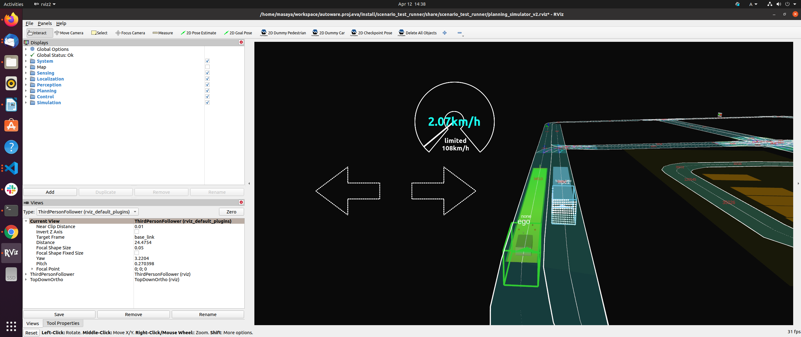

# Simple sensor simulator

The simple sensor simulator is a reference implementation of the simulator which follows our scenario testing framework.  
This package includes very simple sensor or detection result simulation.

Our simple sensor simulators do not include noise simulation, because scenario_simulator_v2 is a testing framework for planners or controllers instead of any perception modules.

[//]: # (This package includes very, very simple lidar simulation and send simulated detection result to the Autoware.)

!!! note
    Simple Sensor Simulator is just a reference implementation, so we can adapt any kinds of autonomous driving simulators if we can develop ZeroMQ interface to your simulator.

## LiDAR Simulation

With this simulation, we can get lidar point-cloud data based on simple ray-casting algorithm.

### Interfaces

| interface                                   | type                                   | note                                             |
|---------------------------------------------|----------------------------------------|--------------------------------------------------|
| `traffic_simulator::API::attachLidarSensor` | C++ traffic simulator API interface    |                                                  |
| `attach_lidar_sensor`                       | ZeroMQ traffic simulator API interface | See [ZeroMQ Interfaces documentation](ZeroMQ.md) |

### Configuration

See [the Lidar Configuration documentation](https://tier4.github.io/scenario_simulator_v2-docs/proto_doc/protobuf/#lidarconfiguration)

### Point Cloud Layout

The layout of `/perception/obstacle_segmentation/pointcloud` is **not a
parameter**. It follows from `architecture_type`, because the layout is a
property of the Autoware under test rather than a preference: an independent
parameter would let a scenario ask for the legacy layout against an Autoware
which only reads the new one, which kills the subscriber.

| `architecture_type`        | Layout        | Fields                                              | Point size |
| -------------------------- | ------------- | --------------------------------------------------- | ---------- |
| `< awf/universe/20260801`  | `PointXYZI`   | `x`, `y`, `z`, `intensity`                          | 32 byte    |
| `>= awf/universe/20260801` | `PointXYZCPE` | `x`, `y`, `z`, `class_id`, `probability`, `entropy` | 24 byte    |

`PointXYZI` is the legacy layout, whose `intensity` is always `0` because this
simulator does not model reflectance. A point is 32 byte rather than the 16 the
four fields suggest, because `pcl::PointXYZI` is padded for SSE alignment.
`PointXYZCPE` is the densely packed point of the 3D semantic segmentation of
Autoware, mirroring `autoware::point_types::PointXYZCPE` of autoware_core
revision `8c3fdfdffa57f5d7b62ca81ff512bec371bc98e8`. It has no `intensity`
field. `awf/universe/20260801` is the date awf/autoware.universe made it the
point type of `label_based_euclidean_cluster`, which is the interface this
simulator has to imitate. Existing scenarios name an older `architecture_type`
and keep the layout they were written against.

#### What a `PointXYZCPE` cloud contains

Only the points whose classification is **not** object compatible, that is those
for which `autoware::object_recognition_utils::is_object_compatible` returns
false. Upstream routes every object compatible point into its detected object
output instead, so a point never appears in both.

A raycast can only hit the bounding box of an entity, so the one entity whose
points reach this topic is a **misc object**, reported as `STRUCTURE` because it
is the only way a scenario can place static world geometry. It is **also**
reported as an `UNKNOWN` detected object, which is intended for a static
obstacle on the ego's path. A scenario with no misc object yields an empty
cloud, which is the correct output rather than a limitation. Vegetation, ground
and buildings cannot be segmented at all, because this simulator holds no
environment beyond the lanelet map; use the planning simulator for those.

`class_id` is the ground truth derived from the type and the subtype of the
entity, and `probability` is `1.0` with `entropy` `0.0`, that is maximum
certainty, because a simulated classification is exact. Neither is ever a
`NaN`. A point whose entity cannot be resolved is dropped rather than reported
with a placeholder classification. An imperfect classification is a sensor
imperfection and would belong to the noise model described below; no such
parameter exists yet.

### Acknowledgments

In lidar simulation, we use intel's ray-casting library embree.

<iframe
class="hatenablogcard"
style="width:100%;height:155px;max-width:450px;"
title="embree"
src="https://hatenablog-parts.com/embed?url=https://github.com/embree/embree"
width="300" height="150" frameborder="0" scrolling="no">
</iframe>

## Occupancy Grid Sensor Simulation

With this simulation, we can get a cost map without processing lidar point cloud data.  
This enables us to reduce computational resources when we want to test Autoware's planners or controllers.  

### Interfaces

| interface                                           | type                                   | note                                             |
|-----------------------------------------------------|----------------------------------------|--------------------------------------------------|
| `traffic_simulator::API::attachOccupancyGridSensor` | C++ traffic simulator API interface    |                                                  |
| `attach_occupancy_grid_sensor`                      | ZeroMQ traffic simulator API interface | See [ZeroMQ Interfaces documentation](ZeroMQ.md) |

### Occupancy Grid Values

| grid type      | value | description                                                         |
|----------------|-------|---------------------------------------------------------------------|
| occupied grid  | 100   | a grid determined by a simulated lidar sensor that an object exists |
| invisible grid | 50    | a grid that is out of range or occlusion of simulated lidar sensor  |
| empty grid     | 0     | an empty grid proved by a simulated ray-cast passing through        |

### Configuration

See [the OccupancyGridSensorConfiguration documentation](https://tier4.github.io/scenario_simulator_v2-docs/proto_doc/protobuf/#occupancygridsensorconfiguration)

## Object Detection Results Simulation

With this simulation, you can get object detection results without processing images by heavy object detection algorithms.  
This also enables you to reduce computational resources when you want to test Autoware's planners or controllers.

### Interfaces

| interface                                       | type                                   | note                                             |
|-------------------------------------------------|----------------------------------------|--------------------------------------------------|
| `traffic_simulator::API::attachDetectionSensor` | C++ traffic simulator API interface    |                                                  |
| `attach_detection_sensor`                       | ZeroMQ traffic simulator API interface | See [ZeroMQ Interfaces documentation](ZeroMQ.md) |

### Configuration

See [the DetectionSensorConfiguration documentation](https://tier4.github.io/scenario_simulator_v2-docs/proto_doc/protobuf/#detectionsensorconfiguration)
