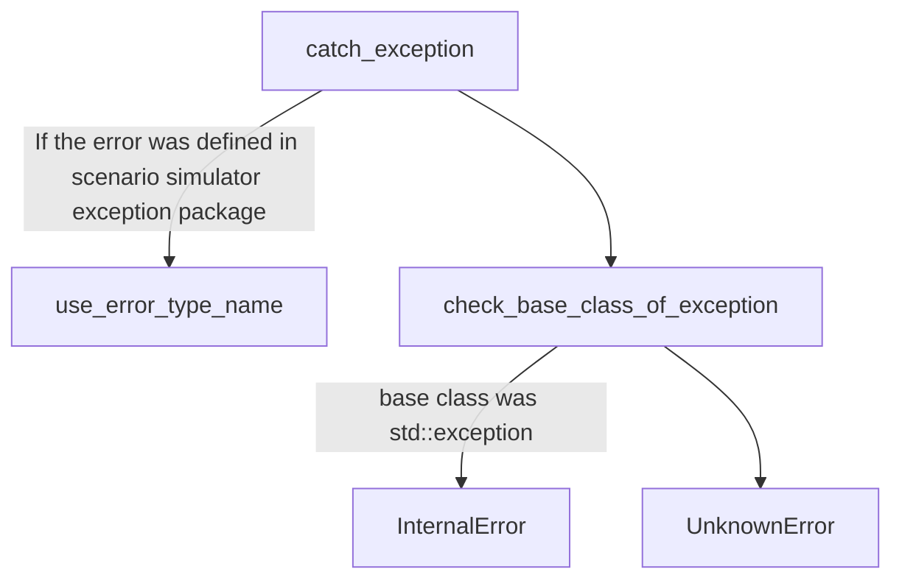

# Simulation Result Format

## File format

Result files should follow the JUnit format.  
[This package](https://github.com/tier4/scenario_simulator_v2/tree/master/common/simple_junit) helps you to output JUnit-formatted files.
An example of the result file is below:

```xml
<?xml version="1.0"?>
<testsuites>
 <testsuite name="example_suite">
  <testcase name="example_case">
   <error type="InternalError" message="foo" />
   <failure type="Failure" message="Expected success" />
  </testcase>
 </testsuite>
 <testsuite name="example_suites" />
</testsuites>
```

The example follows the JUnit 5 format.

### Test Case Result

#### Failure

`Failure` means that the test cases were in an unexpected situation, such as collision, stack, etc.  
Message of the test result should be:

```xml
<failure type="Failure" message="Expected success" />
```

or

```xml
<failure type="Failure" message="Expected failure" />
```

or

```xml
<failure type="Failure" message="Expected error" />
```

#### Error

`Error` means that the test cases were failed with an error, such as some Autoware nodes were downed, failed to launch Autoware, etc.  
All errors are thrown as errors from the API classes.
If you want to see examples, please refer to [this code](https://github.com/tier4/scenario_simulator_v2/tree/master/openscenario/openscenario_interpreter/include/openscenario_interpreter/openscenario_interpreter.hpp).

#### Error Types

Each error type describes its meaning.  
The following flow chart describes what message types should be used:



Output format should be like below:

```xml
<error type="(ERROR_TYPE)" message="(ERROR_MESSAGE)" />
```

If you want to know all exception types defined in the scenario simulator exception package, please refer to [this code](https://github.com/tier4/scenario_simulator_v2/blob/master/common/scenario_simulator_exception/include/scenario_simulator_exception/exception.hpp) and [this document](ErrorCategories.md).  
(ERROR_MESSAGE) is an error message from an exception.

## Usage of simple_junit

Sample codes are below:

```c++
#include <simple_junit/junit5.hpp>

int main()
{
  common::junit::JUnit5 junit;
  junit.testsuite("example_suites");
  common::junit::Error error_case("example_error", "error_test_case");
  junit.testsuite("example_suite").testcase("example_case").error.push_back(error_case);
  common::junit::Failure failure_case("example_failure", "failure_test_case");
  junit.testsuite("example_suite").testcase("example_case").failure.push_back(failure_case);
  junit.write_to("result.junit.xml");
}
```

If you run this code, result.junit.xml should be like below:

```xml
<?xml version="1.0"?>
<testsuites>
 <testsuite name="example_suite">
  <testcase name="example_case">
   <error type="example_error" message="error_test_case" />
   <failure type="example_failure" message="failure_test_case" />
  </testcase>
 </testsuite>
 <testsuite name="example_suites" />
</testsuites>
```

`common::junit::JUnit5` class provides features to output results in the JUnit format.  
`common::junit::Error` class describes the error output.  
`common::junit::Failure` class describes the failure output.
