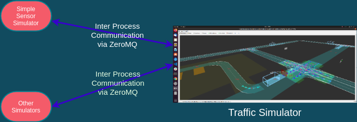
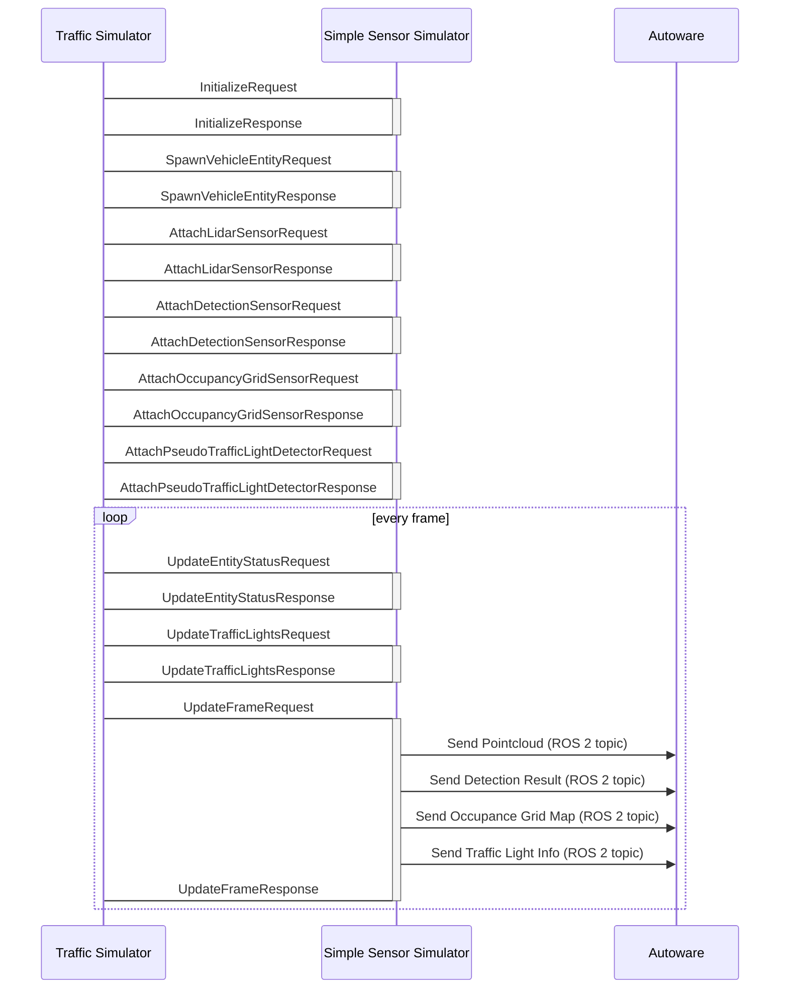

# Communication with simulator and interpreter

We use ZeroMQ Inter-Process communication to communicate with your simulator and traffic simulator.

!!!note
    Simple Sensor Simulator is just a reference implementation. We can adapt any kinds of autonomous driving simulators if we can develop ZeroMQ interface to your simulator.

## What is ZeroMQ

[ZeroMQ](https://zeromq.org/) is an open-source messaging library. It supports TCP/UDP/Inter-Process messaging communication.
We use [ZeroMQ](https://zeromq.org/) in order to communicate with the simulator and interpreter.
We use Request/Reply sockets in order to run the simulators synchronously.

<iframe
  class="hatenablogcard"
  style="width:100%;height:155px;max-width:450px;"
  title="embree"
  src="https://hatenablog-parts.com/embed?url=https://zeromq.org/"
  width="300" height="150" frameborder="0" scrolling="no">
</iframe>

## Sequence diagram

The traffic simulator has a ZeroMQ client and the simple sensor simulator has a ZeroMQ server.
We use [Protocol Buffers](https://developers.google.com/protocol-buffers) (protobuf) in order to serialize data.

```mermaid
sequenceDiagram
    participant Traffic Simulator
    participant Simple Sensor Simulator
    participant Autoware
    Traffic Simulator ->+ Simple Sensor Simulator : InitializeRequest
    Simple Sensor Simulator ->-Traffic Simulator : InitializeResponse
    Traffic Simulator ->+ Simple Sensor Simulator : SpawnVehicleEntityRequest
    Simple Sensor Simulator ->-Traffic Simulator : SpawnVehicleEntityResponse
    Traffic Simulator ->+ Simple Sensor Simulator : AttachLidarSensorRequest
    Simple Sensor Simulator ->-Traffic Simulator : AttachLidarSensorResponse
    Traffic Simulator ->+ Simple Sensor Simulator : AttachDetectionSensorRequest
    Simple Sensor Simulator ->-Traffic Simulator : AttachDetectionSensorResponse
    Traffic Simulator ->+ Simple Sensor Simulator : AttachOccupancyGridSensorRequest
    Simple Sensor Simulator ->-Traffic Simulator : AttachOccupancyGridSensorResponse
    Traffic Simulator ->+ Simple Sensor Simulator : AttachPseudoTrafficLightDetectorRequest
    Simple Sensor Simulator ->-Traffic Simulator : AttachPseudoTrafficLightDetectorResponse
    loop every frame
      Traffic Simulator ->+ Simple Sensor Simulator : UpdateEntityStatusRequest
      Simple Sensor Simulator ->-Traffic Simulator : UpdateEntityStatusResponse
      Traffic Simulator ->+ Simple Sensor Simulator : UpdateTrafficLightsRequest
      Simple Sensor Simulator ->-Traffic Simulator : UpdateTrafficLightsResponse
      Traffic Simulator ->+ Simple Sensor Simulator : UpdateFrameRequest
      Simple Sensor Simulator ->> Autoware : Send Pointcloud (ROS 2 topic)
      Simple Sensor Simulator ->> Autoware : Send Detection Result (ROS 2 topic)
      Simple Sensor Simulator ->> Autoware : Send Occupance Grid Map (ROS 2 topic)
      Simple Sensor Simulator ->> Autoware : Send Traffic Light Info (ROS 2 topic)
      Simple Sensor Simulator ->-Traffic Simulator : UpdateFrameResponse
    end
```

## Schema of the message

The `traffic_simulator::API` sends a request to the simulator. The request is serialized using protobuf and uses the port specified by the ROS Parameter `port` (default is 5555) to communicate with the simulator.

### Protobuf definition

The schema of protobuf is [here](https://github.com/tier4/scenario_simulator_v2/blob/master/simulation/simulation_interface/proto/simulation_api_schema.proto).
All data are serialized as string and sent via TCP by using ZeroMQ.

## Required APIs for co-simulation

The traffic simulator and the simple sensor simulator communicate with APIs. If you want to integrate the simulators with your simulator, only you have to do is preparing the following APIs:

| API                                  | Request                                                                | Response                                                                |
|--------------------------------------|------------------------------------------------------------------------|-------------------------------------------------------------------------|
| initialize                           | [InitializeRequest][simulation_api_schema.proto]                       | [InitializeResponse][simulation_api_schema.proto]                       |
| update_frame                         | [UpdateFrameRequest][simulation_api_schema.proto]                      | [UpdateFrameResponse][simulation_api_schema.proto]                      |
| spawn_vehicle_entity                 | [SpawnVehicleEntityRequest][simulation_api_schema.proto]               | [SpawnVehicleEntityResponse][simulation_api_schema.proto]               |
| spawn_pedestrian_entity              | [SpawnPedestrianEntityRequest][simulation_api_schema.proto]            | [SpawnPedestrianEntityResponse][simulation_api_schema.proto]            |
| spawn_misc_object_entity             | [SpawnMiscObjectEntityRequest][simulation_api_schema.proto]            | [SpawnMiscObjectEntityResponse][simulation_api_schema.proto]            |
| despawn_entity                       | [DespawnEntityRequest][simulation_api_schema.proto]                    | [DespawnEntityResponse][simulation_api_schema.proto]                    |
| update_entity_status                 | [UpdateEntityStatusRequest][simulation_api_schema.proto]               | [UpdateEntityStatusResponse][simulation_api_schema.proto]               |
| attach_lidar_sensor                  | [AttachLidarSensorRequest][simulation_api_schema.proto]                | [AttachLidarSensorResponse][simulation_api_schema.proto]                |
| attach_detection_sensor              | [AttachDetectionSensorRequest][simulation_api_schema.proto]            | [AttachDetectionSensorResponse][simulation_api_schema.proto]            |
| attach_occupancy_grid_sensor         | [AttachOccupancyGridSensorRequest][simulation_api_schema.proto]        | [AttachOccupancyGridSensorResponse][simulation_api_schema.proto]        |
| attach_pseudo_traffic_light_detector | [AttachPseudoTrafficLightDetectorRequest][simulation_api_schema.proto] | [AttachPseudoTrafficLightDetectorResponse][simulation_api_schema.proto] |
| update_traffic_lights                | [UpdateTrafficLightsRequest][simulation_api_schema.proto]              | [UpdateTrafficLightsResponse][simulation_api_schema.proto]              |

[simulation_api_schema.proto]: https://github.com/tier4/scenario_simulator_v2/blob/master/simulation/simulation_interface/proto/simulation_api_schema.proto
