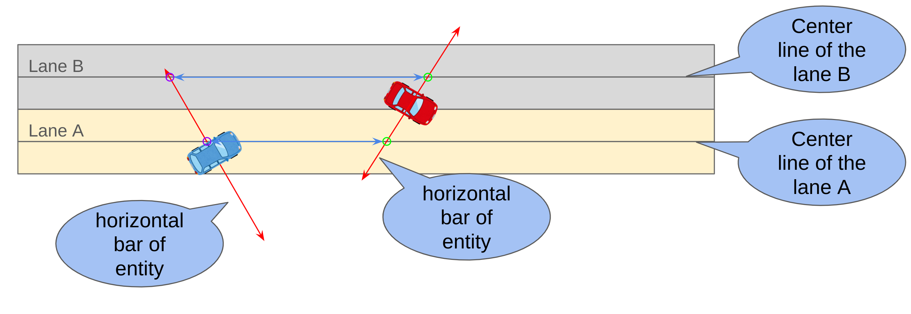

# Lane pose calculation when getting longitudinal distance

Attempts to calculate the pose for adjacent lane coordinate systems when measuring longitudinal distance.  
The length of the horizontal bar must intersect with the adjacent lanelet, [so it is always 10 m regardless of the entity type.](https://github.com/tier4/scenario_simulator_v2/blob/f577103d685523a3e8e19fd72c9a1c3c2d032704/simulation/traffic_simulator/src/utils/distance.cpp#L48-L122)

The shorter of the two blue arrows shown in the figure above is the longitudinal distance between entities.
