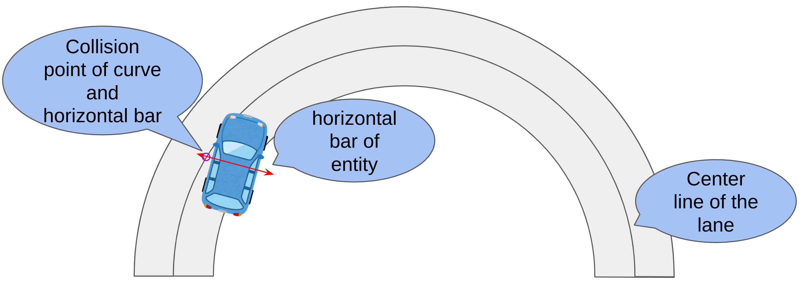

# Lane pose calculation

The calculation method of the lane coordinate system differs from Entity to Entity, and the process of determining which lane to match is complex, including fallback.  
In this document, we will show how the pose calculation of the lane coordinate system is performed for each Entity.

There are 3 possible timings when the lane coordinate system is computed for all Entities.  
These are the [timing immediately after the spawn of the Entity](Spawn.md), the [timing of the frame update](UpdateFrame.md) and the [timing of the getting longitudinal distance](GetLongitudinalDistance.md)

!!! Note
    It is sufficient to check [this document](UpdateFrame.md) and [this section](#lane-coordinate-system-calculation-algorithm-for-a-specific-lane), if you are not a simulator developer but a scenario writer. That is because the distance measurement via condition of the OpenSCENARIO is done after frame update basically.

## Lane coordinate system calculation algorithm for a specific lane

!!! summary
    - The calculation of the pose in the lane coordinate system involves two steps: first, filtering by "which lanes can be matched," and then "calculating the pose in the specific lane coordinate system".  
    - The parameter that most affects the matching results is the length of the horizontal bar. This length depends on the type of entity and the timing of the calculation. If you want to check the length quickly, please check [this section](#quick-guide-to-horizontal-bar-lengths).

### Quick guide to horizontal bar lengths 

The unit of the table is meter.

Tread of the Entity is the maximum value of the tread from its front and rear wheels divided by two.
Tread of the front wheels is $t_f$ and the tread of the rear wheels is $t_r$.
$tread = \frac{max(t_f, t_r)}{2}$

| EntityType \ Timing of calculation | [Spawn](Spawn.md)                                                                                                                                                                                                                                                                               | [UpdateFrame](UpdateFrame.md)                                                                                                                                                                                                                                                                                                                                                                                                                                        | [Getting longitudinal distance](GetLongitudinalDistance.md)                                                                                                            |
| ---------------------------------- | ----------------------------------------------------------------------------------------------------------------------------------------------------------------------------------------------------------------------------------------------------------------------------------------------- | -------------------------------------------------------------------------------------------------------------------------------------------------------------------------------------------------------------------------------------------------------------------------------------------------------------------------------------------------------------------------------------------------------------------------------------------------------------------- | ---------------------------------------------------------------------------------------------------------------------------------------------------------------------- |
| EgoEntity                          | [(tread of the entity) + 1.0](Spawn.md#calculate-pose-in-lane-coordinate-system) ([code](https://github.com/tier4/scenario_simulator_v2/blob/729e4e6372cdba60e377ae097d032905b80763a9/simulation/traffic_simulator/include/traffic_simulator/entity/entity_manager.hpp#L458-L468))              | [(tread of the entity) + 1.0](UpdateFrame.md#calculate-pose-in-lane-coordinate-system) ([code](https://github.com/tier4/scenario_simulator_v2/blob/729e4e6372cdba60e377ae097d032905b80763a9/simulation/traffic_simulator/src/entity/vehicle_entity.cpp#L78-L85), [code](https://github.com/tier4/scenario_simulator_v2/blob/729e4e6372cdba60e377ae097d032905b80763a9/simulation/simple_sensor_simulator/src/vehicle_simulation/ego_entity_simulation.cpp#L453-L456)) | 10 ([code](https://github.com/tier4/scenario_simulator_v2/blob/f577103d685523a3e8e19fd72c9a1c3c2d032704/simulation/traffic_simulator/src/utils/distance.cpp#L48-L122)) |
| VehicleEntity                      | [(tread of the entity) + 1.0](Spawn.md#calculate-pose-in-lane-coordinate-system) ([code](https://github.com/tier4/scenario_simulator_v2/blob/729e4e6372cdba60e377ae097d032905b80763a9/simulation/traffic_simulator/include/traffic_simulator/entity/entity_manager.hpp#L458-L468))              | [(tread of the entity) + 1.0](UpdateFrame.md#calculate-pose-in-lane-coordinate-system) ([code](https://github.com/tier4/scenario_simulator_v2/blob/729e4e6372cdba60e377ae097d032905b80763a9/simulation/traffic_simulator/src/entity/vehicle_entity.cpp#L78-L85))                                                                                                                                                                                                     | 10 ([code](https://github.com/tier4/scenario_simulator_v2/blob/f577103d685523a3e8e19fd72c9a1c3c2d032704/simulation/traffic_simulator/src/utils/distance.cpp#L48-L122)) |
| PedestrianEntity                   | [(width of the entity bounding box) + 1.0](Spawn.md#calculate-pose-in-lane-coordinate-system) ([code](https://github.com/tier4/scenario_simulator_v2/blob/729e4e6372cdba60e377ae097d032905b80763a9/simulation/traffic_simulator/include/traffic_simulator/entity/entity_manager.hpp#L458-L468)) | [(width of the entity bounding box) + 1.0](UpdateFrame.md#calculate-pose-in-lane-coordinate-system) ([code](https://github.com/tier4/scenario_simulator_v2/blob/729e4e6372cdba60e377ae097d032905b80763a9/simulation/traffic_simulator/src/entity/entity_base.cpp#L86-L89))                                                                                                                                                                                           | 10 ([code](https://github.com/tier4/scenario_simulator_v2/blob/f577103d685523a3e8e19fd72c9a1c3c2d032704/simulation/traffic_simulator/src/utils/distance.cpp#L48-L122)) |
| MiscObject                         | [(width of the entity bounding box) + 1.0](Spawn.md#calculate-pose-in-lane-coordinate-system) ([code](https://github.com/tier4/scenario_simulator_v2/blob/729e4e6372cdba60e377ae097d032905b80763a9/simulation/traffic_simulator/include/traffic_simulator/entity/entity_manager.hpp#L458-L468)) | N/A                                                                                                                                                                                                                                                                                                                                                                                                                                                                  | 10 ([code](https://github.com/tier4/scenario_simulator_v2/blob/f577103d685523a3e8e19fd72c9a1c3c2d032704/simulation/traffic_simulator/src/utils/distance.cpp#L48-L122)) |

### Detail of the lane coordinate system calculation algorithm for a specific lane

After the lanes to be matched have been determined, the calculation of the specific lane coordinate system to be performed is always based on a per spline curve and line segment determination.

The centerline of a lane is expressed by the cubic equation [Catmull-Rom spline.](https://en.wikipedia.org/wiki/Centripetal_Catmull%E2%80%93Rom_spline)  
Catmull-Rom spline and line segment are implemented by finding the multiple solution of one cubic equation.  
A specific implementation can be found [here](https://github.com/tier4/scenario_simulator_v2/blob/5f19d39ef29243396f26225976975f0c27914c12/common/math/geometry/src/solver/polynomial_solver.cpp#L98-L131) and [here.](https://github.com/tier4/scenario_simulator_v2/blob/5f19d39ef29243396f26225976975f0c27914c12/common/math/geometry/src/spline/hermite_curve.cpp#L124-L187)

Let $a_i,b_i,c_i,d_i (i = x, y, z)$ $s = [0,1]$ is a coefficient of the spline.  
Then, the spline is a described like below.  

$$x(s) = a_xs^3 + b_xs^2 + c_xs + d_x $$

$$y(s) = a_ys^3 + b_ys^2 + c_ys + d_y $$

$$z(s) = a_zs^3 + b_ys^2 + c_zs + d_z $$

When a hit decision with a line segment is performed, only $x(s),y(s)$ of the above equations are considered, since they are performed in two dimensions.  

The equation of the line segment is expressed as.
Let $e_i,f_i (i = x, y, z)$ $u = [0,1]$ is a coefficient of the line segment.  

$$x(u) = e_xu + f_x $$

$$y(u) = e_yu + f_y $$

$$z(u) = e_zu + f_z $$

When a hit decision with a spline is performed, only $x(u),y(u)$ of the above equations are considered, since they are performed in two dimensions.  

To determine the pertinence of a line segment and a spline, find the values of s and u that satisfy the following equations.  

$$x(s) = x(u) = a_xs^3 + b_xs^2 + c_xs + d_x = e_xu + f_x$$

$$y(s) = y(u) = a_ys^3 + b_ys^2 + c_ys + d_y = e_yu + f_y$$

If $e_x\neq0$
Perform the equation transformation and eliminate the variable $u$.

$$x(u)\frac{e_f}{e_x} = (e_xu + f_x)\frac{e_f}{e_x} = e_fu +\frac{f_xe_f}{e_x} = x(s)\frac{e_f}{e_x} = (a_xs^3 + b_xs^2 + c_xs + d_x)\frac{e_f}{e_x}$$

$$y(s) - x(u)\frac{e_f}{e_x} = a_ys^3 + b_ys^2 + c_ys + d_y - (a_xs^3 + b_xs^2 + c_xs + d_x)\frac{e_f}{e_x} = e_yu + f_y - (e_xu + f_x)\frac{e_f}{e_x} = f_y - \frac{f_xe_f}{e_x}$$

Therefore, we can perform a hit decision between the Spline curve and the line segment by finding a rational solution of the following cubic equation.

$$(a_y - a_x\frac{e_f}{e_x})s^3 + (b_y - b_x\frac{e_f}{e_x})s^2 + (c_y - c_x\frac{e_f}{e_x})s + d_y - d_x\frac{e_f}{e_x} - f_y + \frac{f_xe_f}{e_x} = 0$$

After getting rational solution $s$, calculate $u$ from the linear function.
If the $s$ and $u$ is in $[0,1]$, Catmull-Rom spline and the line segment are determined to be in conflict.

The value of $S$ obtained in this case is the coordinate $S$ in the lane coordinate system.  
Next, the value of $s$ is substituted into the Catmull-Rom spline equation, and the tangent direction at that point is calculated.  
The Euler angle is calculated from the difference in orientation between the obtained tangent direction and Entity.
