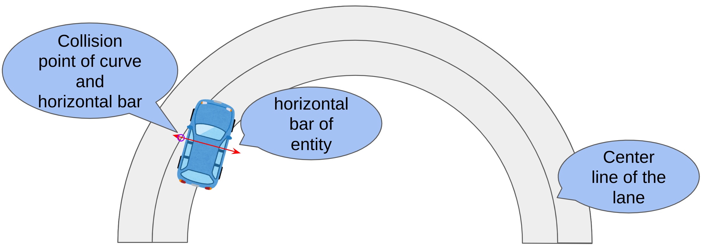

# Lane pose caluculation when updating frames

If the entity's behavioral logic is planned in the lane coordinate system, skip this process.

## Ego Entity

Since EgoEntity is controlled by Autoware rather than the behavior plugin, this process is performed for every frame update.  
This process is implemented [here](https://github.com/tier4/scenario_simulator_v2/blob/5f19d39ef29243396f26225976975f0c27914c12/simulation/traffic_simulator/src/api/api.cpp#L240C9-L240C19) and [here](https://github.com/tier4/scenario_simulator_v2/blob/5f19d39ef29243396f26225976975f0c27914c12/simulation/traffic_simulator/src/entity/ego_entity.cpp#L276-L312).

### Search for matching lanes

This process branches off into 2 or 3 depending on the outcome of 1.  
If 3 is executed and fails, fallbacks to 4.

1. [Obtain a candidate lane for matching from Autoware planner output.](https://github.com/tier4/scenario_simulator_v2/blob/5f19d39ef29243396f26225976975f0c27914c12/simulation/traffic_simulator/src/entity/ego_entity.cpp#L276)
2. [If Autoware has no planner output, try obtaining candidate lanes for matching considering the bounding box.](https://github.com/tier4/scenario_simulator_v2/blob/5f19d39ef29243396f26225976975f0c27914c12/simulation/traffic_simulator/src/entity/ego_entity.cpp#L286-L287)
3. [If Autoware has planner output, try matching considering the Autoware planner output.](https://github.com/tier4/scenario_simulator_v2/blob/5f19d39ef29243396f26225976975f0c27914c12/simulation/traffic_simulator/src/entity/ego_entity.cpp#L289-L290)
4. [If the step 3 failed, try obtaining candidate lanes for matching considering the bounding box.](https://github.com/tier4/scenario_simulator_v2/blob/5f19d39ef29243396f26225976975f0c27914c12/simulation/traffic_simulator/src/entity/ego_entity.cpp#L292-L293)

### Calculate pose in lane coordinate system

Let $L_m$ be the length of the horizontal bar used in the lane coordinate system calculation and the tread of the front wheels be  $t_f$ and the tread of the rear wheels be $t_r$.
See also [here.](https://github.com/tier4/scenario_simulator_v2/blob/5f19d39ef29243396f26225976975f0c27914c12/simulation/traffic_simulator/src/entity/ego_entity.cpp#L278-L284)

$$L_m = max(t_r, t_f) + 2.0$$

## Non-Ego Entity

For non-EgoEntity, the process diverges depending on whether planning is done in the lane coordinate system inside BehaviorPlugin.  
If planning is done in the lane coordinate system, there is no need to convert from the map coordinate system to the lane coordinate system after onUpdate is executed.

### VehicleEntity (with Behavior-Tree)

### Vehicle Entity (with Do-Nothing)

While the do-nothing behavior plugin is running, Entity does not move, so the lane coordinate system is calculated at spawn and is not recalculated thereafter.

### Pedestrian Entity (with Behavior-Tree)

### Pedestrian Entity (with Do-Nothing)

While the do-nothing behavior plugin is running, Entity does not move, so the lane coordinate system is calculated at spawn and is not recalculated thereafter.
