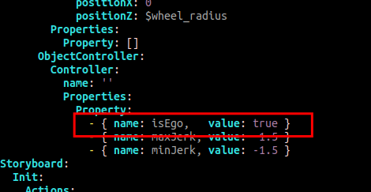
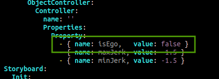
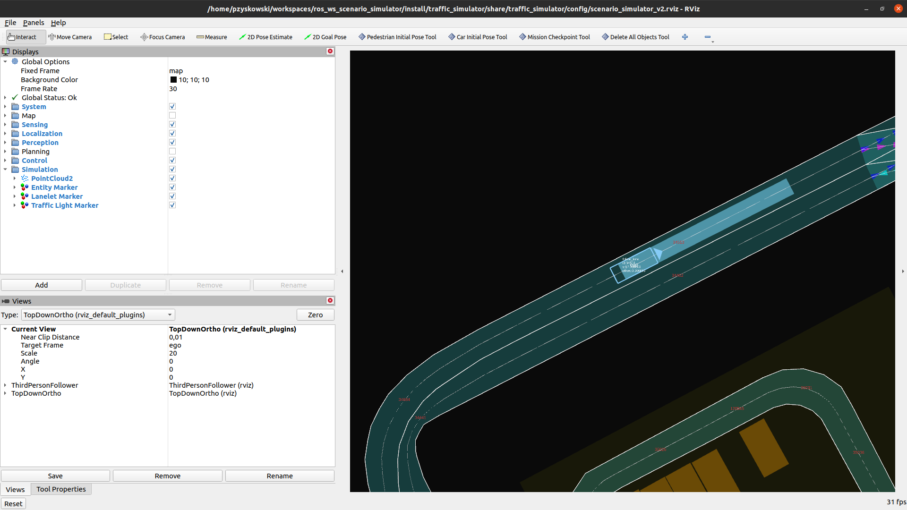

# Running `scenario_simulator_v2` without Autoware

This tutorial describes all steps necessary to run `scenario_simulator_v2` without Autoware.

## Prerequisites

This instruction assumes operating system: Ubuntu 20.04 LTS Desktop. It can be downloaded [here](https://releases.ubuntu.com/20.04/ubuntu-20.04.4-desktop-amd64.iso.torrent?_ga=2.16051123.40853476.1646667651-285741320.1646667651)

## How to build

### Install and setup ROS2 environment

Instruction below is based on [official ROS2 instruction](https://docs.ros.org/en/galactic/Installation/Ubuntu-Install-Debians.html)

Check locale information
```
locale
```

It is important that output contains UTF-8 formatting. Might be similar to text below:
```
LANG=en_US.UTF-8
LANGUAGE=
LC_CTYPE="en_US.UTF-8"
LC_NUMERIC=pl_PL.UTF-8
LC_TIME=pl_PL.UTF-8
LC_COLLATE="en_US.UTF-8"
LC_MONETARY=pl_PL.UTF-8
LC_MESSAGES="en_US.UTF-8"
LC_PAPER=pl_PL.UTF-8
LC_NAME=pl_PL.UTF-8
LC_ADDRESS=pl_PL.UTF-8
LC_TELEPHONE=pl_PL.UTF-8
LC_MEASUREMENT=pl_PL.UTF-8
LC_IDENTIFICATION=pl_PL.UTF-8
LC_ALL=
```

If it's not execute:

```
sudo apt-get update && sudo apt-get install -y locales
sudo locale-gen en_US en_US.UTF-8
sudo update-locale LC_ALL=en_US.UTF-8 LANG=en_US.UTF-8
LANG=en_US.UTF-8
```

Verify setting again:
```
locale
```

Add ros repository for apt to use
```
sudo apt update && sudo apt install -y curl gnupg lsb-release
curl -sSL https://raw.githubusercontent.com/ros/rosdistro/master/ros.key  -o /usr/share/keyrings/ros-archive-keyring.gpg
echo "deb [arch=$(dpkg --print-architecture) signed-by=/usr/share/keyrings/ros-archive-keyring.gpg] http://packages.ros.org/ros2/ubuntu $(lsb_release -cs) main" | tee /etc/apt/sources.list.d/ros2.list > /dev/null
```

Update packages information and install ROS2 Galactic:
```
sudo apt update
sudo apt install -y ros-galactic-desktop
```

### Get scenario simulator

Install git
```
sudo apt install -y git
```

Create directory for a workspace and enter this directory.
Throughout this document replace `<workspace_directory>` with a convenient name.
```
mkdir -p <workspace_directory>/src
cd <workspace_directory>/src
```

Clone `scenario_simulator_v2` repository and enter it's directory:

```
git clone https://github.com/tier4/scenario_simulator_v2.git
cd scenario_simulator_v2
```

### Downloading dependencies

Install vcs tools
```
sudo apt install -y python3-vcstool
```

Download `scenario_simulator_v2` dependencies
```
vcs import scenario_simulator_v2/external < scenario_simulator_v2/dependency_galactic.repos
```

Get and initialize `rosdep` tool that enables downloading the system dependencies of `scenario_simulator_v2` packages
```
sudo apt install -y python3-pip
sudo pip install -U rosdep
sudo rosdep init
```

Update `rosdep` packages information and download `scenario_simulator_v2` dependencies
```
rosdep update
rosdep install -iry --from-paths . --rosdistro galactic
```

### Building `scenario_simulator_v2`

Install `colcon` build tool:
```
apt install -y python3-colcon-common-extensions
```

Move to workspace directory:
```
cd `<workspace_directory>`
```

Source ROS2 environment script:

```
source /opt/ros/galactic/setup.bash
```

Build workspace content
```
colcon build
```

This process should end with all packages built. Some packages might be reported to have `stderr output` - this is fine.
```
Summary: 47 packages finished [12min 48s]
  1 package had stderr output: simple_sensor_simulator
```

## How to run

This part of the instruction is based on scenario:
```
<workspace_directory>/src/scenario_simulator_v2/test_runner/scenario_test_runner/scenario/sample.yaml
```

### Necessary scenario modification

Running scenarios with disabled Autoware requires minor scenario modification.

By default scenarios expect main vehicle to be spawned as Ego, meaning that it is controlled by Autoware software:



To run `scenario_simulator_v2` without Autoware `isEgo` value should be changed to `false`



### Scenario execution

To execute scenario, move to workspace directory and source workspace setup script

```
cd `<workspace_directory>`
source install/setup.bash
```

And execute:
```
ros2 launch scenario_test_runner scenario_test_runner.launch.py scenario:='src/scenario_simulator_v2/test_runner/scenario_test_runner/scenario/sample.yaml' launch_rviz:=true
```

Command above should run `rviz` visualization tool. Vehicle should be moving along the lane



### Troubleshooting


