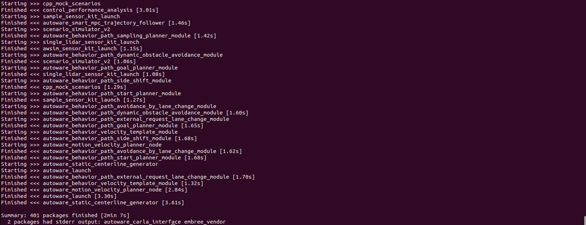
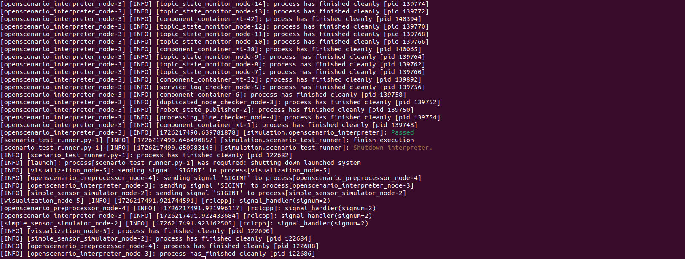
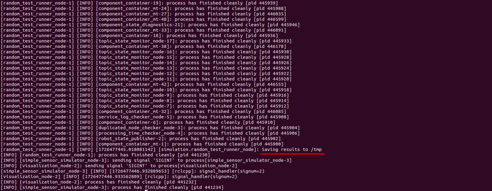
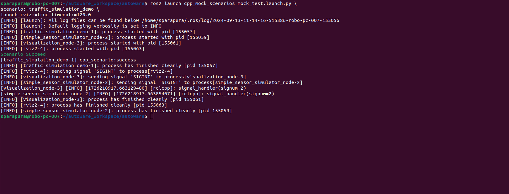

## Quick Start  

### Scenario Simulator v2 with Autoware Universe

This guide provides step-by-step instructions for building and running **Scenario Simulator v2** alongside [**Autoware Universe**](https://github.com/autowarefoundation/autoware). It covers the required setup and prerequisites.

## Prerequisites 

1. Ubuntu 22.04 machine
2. ROS 2 Humble Hawksbill desktop version [installed](https://docs.ros.org/en/humble/Installation/Ubuntu-Install-Debians.html)

## How to build

   1. Clone the Autoware Universe repository.
      ```bash
      git clone git@github.com:autowarefoundation/autoware.git
      ```

   2. Move to the workspace directory.
      ```bash
      cd autoware 
      mkdir src 
      ```

   3. Import Autoware and Simulator dependencies.
      ```bash
      vcs import src < autoware.repos  
      vcs import src < simulator.repos
      ```

   4. Install dependencies for Autoware Universe.
      ```bash
      ./setup-dev-env.sh
      ```
!!! note
    This step will install necessary dependencies, including ROS 2, if not already installed. <br> Make sure to confirm and agree with the licenses for NVIDIA libraries like [CUDA](https://docs.nvidia.com/cuda/eula/index.html), cuDNN, and [TensorRT](https://docs.nvidia.com/deeplearning/tensorrt/sla/index.html).

   5. Install dependent ROS packages.
      ```bash
      source /opt/ros/humble/setup.bash
      rosdep install -iry --from-paths src --rosdistro $ROS_DISTRO
      ```

   6. Build the workspace.
      ```bash
      colcon build --symlink-install --cmake-args -DCMAKE_BUILD_TYPE=Release
      ```
!!! note
    For detailed guidance on build issues and troubleshooting, please refer to the [Autoware Troubleshooting Guide](https://autowarefoundation.github.io/autoware-documentation/main/support/troubleshooting/#build-issues).

   
   *As a result of running the `colcon build` command, all packages should be built successfully.*

## How to run

### Preparation

   1. Move to the workspace directory.
      ```bash
      cd path/to/workspace
      ```

   2. Source the workspace setup script.
      ```bash
      source install/setup.bash
      ```
### Run the examples

#### scenario_test_runner
   ```bash
   ros2 launch scenario_test_runner scenario_test_runner.launch.py \
   architecture_type:=awf/universe/20250130 \
   record:=false \
   scenario:='$(find-pkg-share scenario_test_runner)/scenario/sample.yaml' \
   sensor_model:=sample_sensor_kit \
   vehicle_model:=sample_vehicle
   ``` 
   
   *The process of launching the `scenario_test_runner` node.*

   
   *The expected outcome of running the `scenario_test_runner` node.*
   
#### random_test_runner
   ```bash
   ros2 launch random_test_runner random_test.launch.py \
   architecture_type:=awf/universe/20250130 \
   sensor_model:=sample_sensor_kit \
   vehicle_model:=sample_vehicle timeout:=120.0
   ``` 
!!! note
    To modify parameters of random testing and to obtain more details about the test results and the **result.junit.xml** file (which is saved by default in the **/tmp** directory), please refer to the **random_test_runner** [documentation](random_test_runner/Usage.md).

   
   *The process of launching the `random_test_runner` node.*

   
   *The expected outcome of running the `random_test_runner` node.*
 
#### cpp scenario demo
   ```bash
   ros2 launch cpp_mock_scenarios mock_test.launch.py \
   scenario:=traffic_simulation_demo \
   launch_rviz:=true timeout:=120.0
   ```
   
   *The process of launching the `cpp_mock_scenarios` node.*

   
   *The expected outcome of running the `cpp_mock_scenarios` node.*
