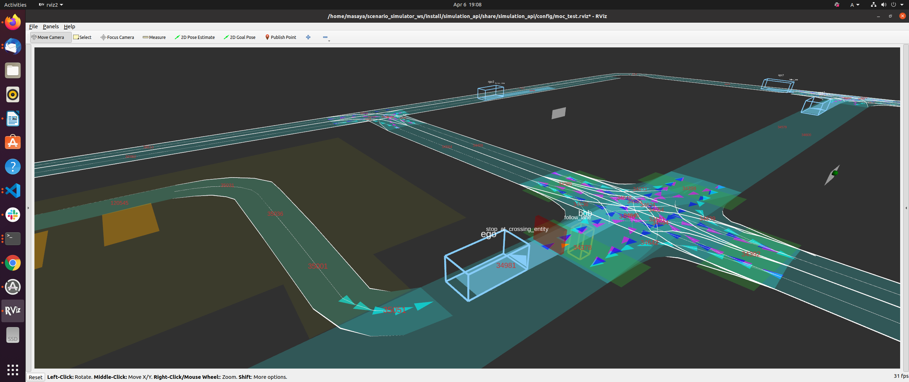

# Quick Start
Scenario simulator with Autoware Universe<br/>
This document contains step-by-step instruction on how to build and run [AWF Autoware Core/Universe](https://github.com/autowarefoundation/autoware) with `scenario_simulator_v2`.

## Prerequisites 

1. Ubuntu 22.04 machine
3. ROS 2 Humble Hawksbill desktop version [installed](https://docs.ros.org/en/humble/Installation/Ubuntu-Install-Debians.html)

## How to build

1. Clone the Autoware Core/Universe repository:
   ```bash
   git clone git@github.com:autowarefoundation/autoware.git
   ```
2. Navigate to the source directory:
   ```bash
   cd autoware 
   mkdir src 
   ```
3. Import Autoware and Simulator dependencies:
   ```bash
   vcs import src < autoware.repos  
   vcs import src < simulator.repos
   ```
4. Install dependencies for Autoware Core/Universe
   ```bash
   ./setup-dev-env.sh
   ``` 
[//]: # (   > Note. This step is only required during first installation/usage of Autoware Core/Universe)

[//]: # (   > )

[//]: # (   > Note: Before installing NVIDIA libraries, confirm and agree with the licenses.)

[//]: # (   - [CUDA]&#40;https://docs.nvidia.com/cuda/eula/index.html&#41;)

[//]: # (   - [cuDNN]&#40;https://docs.nvidia.com/deeplearning/cudnn/sla/index.html&#41;)

[//]: # (   - [TensorRT]&#40;https://docs.nvidia.com/deeplearning/tensorrt/sla/index.html&#41;)

5. Install dependent ROS packages.
   ```bash
   source /opt/ros/humble/setup.bash
   rosdep install -iry --from-paths src --rosdistro $ROS_DISTRO
   ```
6. Build the workspace.
   ```bash
   colcon build --symlink-install --cmake-args -DCMAKE_BUILD_TYPE=Release
   ```

## How to run

### Preparation
1. Move to project directory, where the project is build.
   ```bash
   cd path/to/workspace
   ```
2. Source the workspace setup script
   ```bash
   source install/setup.bash
   ```
### Run the examples

#### scenario_test_runner
   ```bash
   ros2 launch scenario_test_runner scenario_test_runner.launch.py \
   architecture_type:=awf/universe/20230906 \
   record:=false \
   scenario:='$(find-pkg-share scenario_test_runner)/scenario/sample.yaml' \
   sensor_model:=sample_sensor_kit \
   vehicle_model:=sample_vehicle
   ``` 
   
#### random_test_runner
   ```bash
   ros2 launch random_test_runner random_test.launch.py \
   architecture_type:=awf/universe/20230906 \
   sensor_model:=sample_sensor_kit \
   vehicle_model:=sample_vehicle
   ``` 
   
   To modify parameters of random testing, please check documentation of [random_test_runner](random_test_runner/Usage.md)

#### cpp scenario demo
   This demo does not use Autoware. the ego vehicle is interpreted as an NPC.
   ```bash
   ros2 launch cpp_mock_scenarios mock_test.launch.py \
   scenario:=traffic_simulation_demo \
   launch_rviz:=true timeout:=60.0
   ```

   
   
[//]: # (### Troubleshooting)
