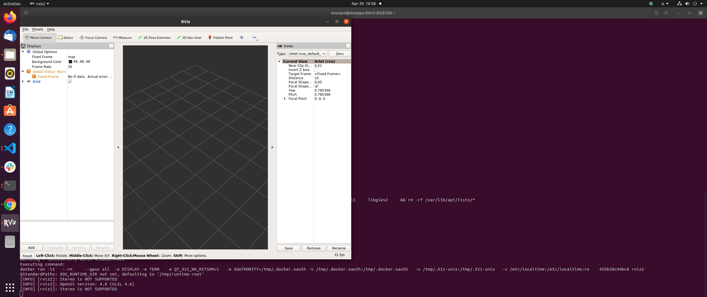

# Run with docker

You can use this scenario_simulator_v2 with docker.
We automatically build docker images by using GitHub Actions and push them into Docker Hub.

If you want to run scenario_simulator_v2 with docker, please follow the instructions below.

Currently, macOS and Windows are not supported.

## Install docker

Please follow the instructions below.

<iframe
    src="https://hatenablog-parts.com/embed?url=https%3A%2F%2Fdocs.docker.com%2Fengine%2Finstall%2F"
    title="Install Docker Engine"
    class="embed-card embed-webcard"
    scrolling="no"
    frameborder="0"
    style="display: block; width: 100%; height: 155px; max-width: 500px; margin: 10px 0px;">
</iframe>

If you finished installing docker, please execute the commands below in order to check docker is working well.

```bash
docker run hello-world
```

You can see the output like below if you have succeeded to install docker.

```bash
Unable to find image 'hello-world:latest' locally
latest: Pulling from library/hello-world
2db29710123e: Pull complete 
Digest: sha256:80f31da1ac7b312ba29d65080fddf797dd76acfb870e677f390d5acba9741b17
Status: Downloaded newer image for hello-world:latest

Hello from Docker!
This message shows that your installation appears to be working correctly.

To generate this message, Docker took the following steps:
 1. The Docker client contacted the Docker daemon.
 2. The Docker daemon pulled the "hello-world" image from the Docker Hub.
    (amd64)
 3. The Docker daemon created a new container from that image which runs the
    executable that produces the output you are currently reading.
 4. The Docker daemon streamed that output to the Docker client, which sent it
    to your terminal.

To try something more ambitious, you can run an Ubuntu container with:
 $ docker run -it ubuntu bash

Share images, automate workflows, and more with a free Docker ID:
 https://hub.docker.com/

For more examples and ideas, visit:
 https://docs.docker.com/get-started/

```

## Install nvidia-docker2 (optional)

If you have NVIDIA GPU(s) in your machine, you have to install nvidia-driver and nvidia-docker2.

### Ubuntu

In order to install nvidia-docker2 on Ubuntu, please execute the commands below.

```bash
curl -s -L https://nvidia.github.io/nvidia-container-runtime/gpgkey | sudo apt-key add -
curl -s -L https://nvidia.github.io/nvidia-container-runtime/ubuntu20.04/nvidia-container-runtime.list | \
  sudo tee /etc/apt/sources.list.d/nvidia-container-runtime.list
sudo apt-get update
sudo apt install -y nvidia-docker2
sudo systemctl restart docker.service
```

If you finished installing docker and nvidia-docker2, please execute the commands below.

```bash
docker run --gpus all --rm nvidia/cuda:11.4.0-base nvidia-smi
```

You can see the outputs like below.

```bash
Thu Jun  2 05:52:32 2022       
+-----------------------------------------------------------------------------+
| NVIDIA-SMI 470.129.06   Driver Version: 470.129.06   CUDA Version: 11.4     |
|-------------------------------+----------------------+----------------------+
| GPU  Name        Persistence-M| Bus-Id        Disp.A | Volatile Uncorr. ECC |
| Fan  Temp  Perf  Pwr:Usage/Cap|         Memory-Usage | GPU-Util  Compute M. |
|                               |                      |               MIG M. |
|===============================+======================+======================|
|   0  NVIDIA GeForce ...  Off  | 00000000:01:00.0  On |                  N/A |
| 41%   39C    P8    25W / 250W |   1236MiB / 10985MiB |      3%      Default |
|                               |                      |                  N/A |
+-------------------------------+----------------------+----------------------+
                                                                               
+-----------------------------------------------------------------------------+
| Processes:                                                                  |
|  GPU   GI   CI        PID   Type   Process name                  GPU Memory |
|        ID   ID                                                   Usage      |
|=============================================================================|
+-----------------------------------------------------------------------------+
```

## Install rocker

<iframe
  class="hatenablogcard"
  style="width:100%;height:155px;max-width:450px;"
  title="rocker"
  src="https://hatenablog-parts.com/embed?url=https://github.com/osrf/rocker"
  width="300" height="150" frameborder="0" scrolling="no">
</iframe>

rocker is a docker support tool for ROS.
It enables us to run rviz inside docker very easily.
You can install rocker via pip3.

```bash
sudo pip3 install git+https://github.com/osrf/rocker.git
```

After install rocker, please check rocker works correctly.
If your machine has GPU(s), please execute the commands below.

```bash
rocker --nvidia --x11 osrf/ros:galactic-desktop rviz2
```

You can see rviz working on docker.


If your machine has no GPU, please execute the commands below.

```bash
rocker --x11 osrf/ros:galactic-desktop rviz2
```

You can see the same result with NVIDIA GPU.

## Build docker image locally (optional)

If you want to build a docker image in your local machine, please execute the commands below in your terminal.

```bash
cd (path_to_scenario_simulator_v2)
docker build -t scenario_simulator_v2 . --build-arg ROS_DISTRO=galactic
```

## Running Simulation with docker.

### Running with docker image in your machine.

Please execute this commands and run [simple demo](SimpleDemo.md) in your local terminal.

If your local machine has NVIDIA GPU(s),

```bash
rocker --nvidia --x11 scenario_simulator_v2 ros2 launch cpp_mock_scenarios mock_test.launch.py scenario:=crashing_npc scenario:=traffic_simulation_demo launch_rviz:=true timeout:=60.0
```

If your local machine does not have NVIDIA GPU(s),

```bash
rocker --x11 scenario_simulator_v2 ros2 launch cpp_mock_scenarios mock_test.launch.py scenario:=crashing_npc scenario:=traffic_simulation_demo launch_rviz:=true timeout:=60.0
```

### Running with docker image from Docker Hub.

We automatically build docker images of scenario_simulator_v2 by using GitHub Actions and put them into our Docker Hub repository.

[](https://github.com/tier4/scenario_simulator_v2/actions/workflows/Docker.yaml)

[](https://hub.docker.com/r/tier4/scenario_simulator_v2)

We can pull the docker image from Docker Hub and run simulation with scenario_simulator_v2 just executing the commands below.

If your local machine has NVIDIA GPU(s),

```bash
docker pull tier4/scenario_simulator_v2:galactic
rocker --nvidia --x11 tier4/scenario_simulator_v2:galactic ros2 launch cpp_mock_scenarios mock_test.launch.py scenario:=crashing_npc scenario:=traffic_simulation_demo launch_rviz:=true timeout:=60.0
```

If your local machine does not have NVIDIA GPU(s),

```bash
docker pull tier4/scenario_simulator_v2:galactic
rocker --x11 tier4/scenario_simulator_v2:galactic ros2 launch cpp_mock_scenarios mock_test.launch.py scenario:=crashing_npc scenario:=traffic_simulation_demo launch_rviz:=true timeout:=60.0
```

<video
  class="c-video__embed"
  src="https://user-images.githubusercontent.com/10348912/115502051-44ab8500-a2af-11eb-9244-4a1d0f2a2b2a.mp4"
  width="100%"
  loop
  autoplay
  muted
  playsinline>
</video>
