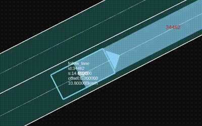

# Scenario Example

Sample pieces of scenario

## Lane Change

with this piece of scenario, lane change will be executed as below.

- the shape of trajectory is smooth, and it is based on a cubic spline curve
- it takes 5 seconds to finish the lane change
-  the target lane is left (left is positive)

```yaml
Action:
  - name: lane_change
    PrivateAction:
      LateralAction:
        LaneChangeAction:
          LaneChangeActionDynamics:
            dynamicsDimension: time
            dynamicsShape: cubic
            value: 5
          LaneChangeTarget:
            RelativeTargetLane:
              entityRef: ego
              value: 1
```





## Exit with Success when Autoware reaches the target

When the state of Autoware becomes `ARRIVED_GOAL`, execute `exitSuccess` of `CustomCommandAction`.
If you have set multiple destinations, it is a good idea to use `DistanceCondition` to check if the Autoware have arrived at the correct destination.
```yaml
Event:
  - name: ''
    priority: parallel
    StartTrigger:
      ConditionGroup:
        - Condition:
            - name: ''
              delay: 0
              conditionEdge: none
              ByValueCondition:
                UserDefinedValueCondition:
                  name: ego.currentState
                  rule: equalTo
                  value: ARRIVED_GOAL
    Action:
      - name: ''
        UserDefinedAction:
          CustomCommandAction:
            type: exitSuccess
```

## Exit with failure when scenario has timed out
It's important to have a timeout in case the scenario or Autoware doesn't work as intended.
The example below is written to time out after 3 minutes(180 seconds).
```yaml
Event:
  - name: ''
    priority: parallel
    StartTrigger:
      ConditionGroup:
        - Condition:
            - name: ''
              delay: 0
              conditionEdge: none
              ByValueCondition:
                SimulationTimeCondition:
                  value: 180
                  rule: greaterThan
    Action:
      - name: ''
        UserDefinedAction:
          CustomCommandAction:
            type: exitFailure
```

## Use custom topic content in scenario
In `UserDefinedValueCondition`, you can treat ros2 topic content by writing the name of topic in the name field.
Caution: this function supports `tier4_simulation_msgs::msg::UserDefinedValue` type only
The example below is using the value from `/count_up` topic.
```yaml
Condition:
- name: ''
  delay: 0
  conditionEdge: none
  ByValueCondition:
    UserDefinedValueCondition:
      name: /count_up
      value: 500
      rule: greaterThan
```
