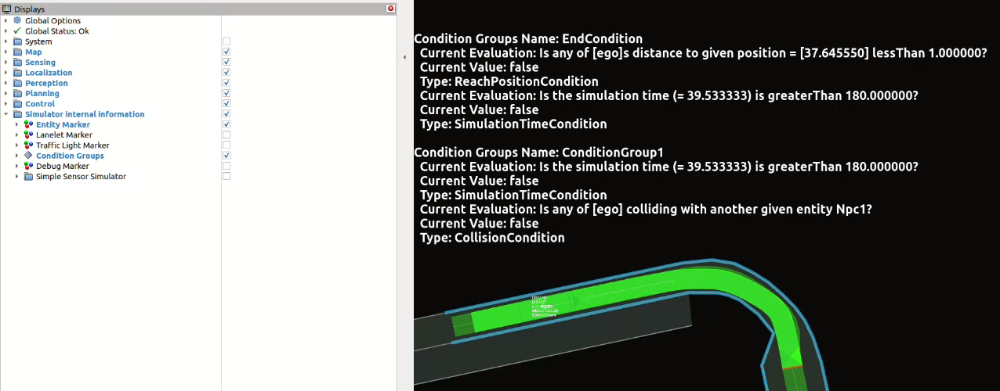

# **Visualizing the Internal Information of the Simulator**

This document provides instructions for users on how to visualize the internal information of `scenario_simulator_v2` using rviz. It also covers features that can be beneficial for analyzing this information. Please note, **this document is based on information up to version v0.7.0**.

## Table of Contents

- [**Visualizing the Internal Information of the Simulator**](#visualizing-the-internal-information-of-the-simulator)
  - [Table of Contents](#table-of-contents)
  - [**Visualizing Entity Information**](#visualizing-entity-information)
  - [**Visualizing the Status of ConditionGroups**](#visualizing-the-status-of-conditiongroups)

## **Visualizing Entity Information**

WIP

## **Visualizing the Status of ConditionGroups**

`ConditionGroup`s defined in the scenario file can be checked on rviz, a visualization tool.

A `ConditionGroup` acts as a trigger for events described in the scenario. A `ConditionGroup` is deemed true when all its sub-Conditions are fulfilled. Furthermore, event triggers can have multiple `ConditionGroup`s. If the evaluation of any one `ConditionGroup` becomes true, the trigger is activated.

One usage example is to display `ConditionGroup`s at the moment the scenario fails. This allows you to analyze the cause of the failure.

The display structure is as follows, and allows multiple Conditions to be included in one `ConditionGroup`:

```markdown
Condition Group Name: xxx
Current Evaluation: xxx
Current Value: true/false
Type: ReachPositionCondition, CollisionCondition, etc.
Current Evaluation:
Current Value:
Type:
︙
Condition Group Name: xxx
Current Evaluation: xxx
Current Value: true/false
Type: ReachPositionCondition, CollisionCondition, etc.
Current Evaluation:
Current Value:
Type:
︙
```

Each condition is described using three elements:

- **Current Evaluation**: Current achievement status
- **Current Value**: The fulfillment status of the condition expressed in true/false
- **Type**: Types of conditions, such as `ReachPositionCondition`, `CollisionCondition`, etc.

To visualize the achievement status, check the `ConditionGroup` checkbox as demonstrated in the image below. 
") 

If an `Event name` is defined in the `ConditionGroup`, that name will be reflected. If left blank, names like `ConditionGroup1`, `ConditionGroup2`, `ConditionGroup3`, etc. are automatically assigned. However, this information alone doesn't clarify if each `ConditionGroup` is linked to success or failure conditions. Therefore, when visualizing with rviz and you want this information to be apparent, we recommend explicitly defining the `Event name` as `SuccessCondition` or similar when creating the scenario file.

---
