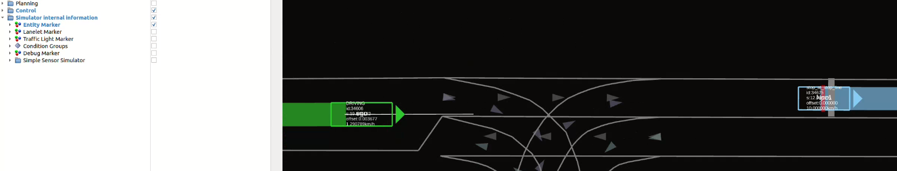

# Visualizing Internal Information of the Simulator

This document describes certain features for visualizing the internal information of `scenario_simulator_v2` using rviz. The information held by `scenario_simulator_v2` and the information sent to the evaluation target autonomous driving system (in this case, Autoware) may not always match. Therefore, it is crucial to accurately understand what the currently displayed information represents. Furthermore, we also provide a simple feature to visualize the status and type of conditions defined in the scenario file, which can be helpful for debugging. Please note that the visualization feature is currently under development and may change in the future. **This document is based on information as of July 2023.**

## Recognition of Entities

Firstly, it should be clear that not all Entities (such as ego vehicle, other vehicles, pedestrians, etc.) defined internally by `scenario_simulator_v2` are accurately transmitted to the target autonomous driving system. For instance, while moving other vehicles are recognized by `simple_sensor_simulator` and transmitted to Autoware, the recognition logic is designed to simply emulate the operation of sensors. Therefore, in certain cases such as when entities are at a very long distance, they may not be recognized or may be transmitted with recognition errors. For these reasons, visualizing only the internal information of `scenario_simulator_v2` could result in overlooking the fact that Autoware might be operating without recognizing these entities, potentially leading to errors in scenario analysis. You can visualize the Entity information held internally by `scenario_simulator_v2` by checking the `Entity Marker` checkbox in the `Simulator internal information` box, as shown in the figure below.

  

## Visualizing the Status of ConditionGroup

You can check the fulfillment status of the `ConditionGroup` defined in the scenario file on rviz. If an `Event name` is defined for `ConditionGroup`, that name is reflected. If it is blank, names such as `ConditionGroups1`,`ConditionGroups2`,`ConditionGroups3` etc. are automatically assigned. However, it's important to note that with this information alone, it is not possible to determine whether each `ConditionGroups` is linked to a success or failure condition. Therefore, if you want to check this information when visualizing in rviz, it is recommended to explicitly define the `Event name` as `SuccessCondition` etc. when creating the scenario file. Visualization of the fulfillment status can be done by checking the `ConditionGroup` checkbox, as shown in the figure below.

  

