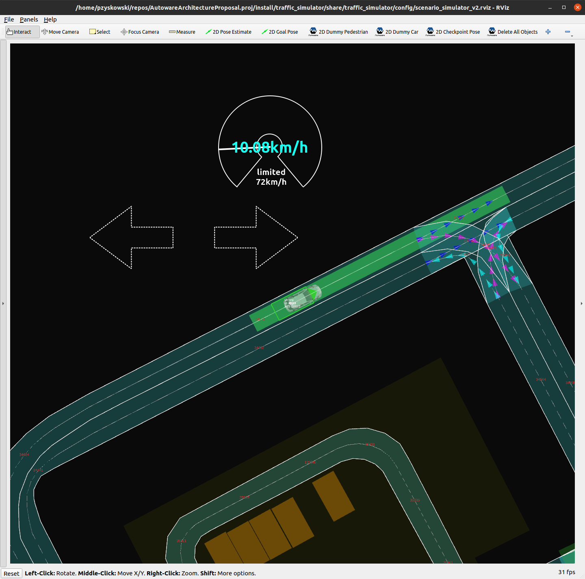

# Scenario simulator with Autoware Architecture Proposal

This document contains step-by-step instruction on how to build and run [Autoware Architecture Proposal](https://github.com/tier4/AutowareArchitectureProposal.proj) with `scenario_simulator_v2`.

## Prerequisites

1. Ubuntu 20.04 machine
2. Hardware with CUDA 11.1 capable graphics card
3. ROS 2 Galactic Geochelone desktop version [installed](https://docs.ros.org/en/humble/Installation/Ubuntu-Install-Debians.html) and sourced:

   ```bash
   source /opt/ros/humble/setup.bash
   ```

## How to build

1. Clone `AutowareArchitectureProposal.proj` repository

    ```bash
    git clone git@github.com:tier4/AutowareArchitectureProposal.proj.git
    ```

2. Move to repository's directory, create `src` dir and checkout dependant repositories using `vcs` tool:

    ```bash
    cd AutowareArchitectureProposal.proj
    mkdir src
    vcs import src < autoware.proj.repos
    ```

3. Run `setup_ubuntu20.04.sh` script

    Execute:

    ```bash
    ./setup_ubuntu20.04.sh
    ```

    It will install system dependencies using `rosdep` and several other system dependencies.

    During execution script will ask about:

    - Entering a sudo password

    ```bash
    BECOME password:
    ```

    - Installation of CUDA and other GPU related tools:

    ```bash
    Would you like to install the optional GPU modules (cuda: 11.1, cudnn: 8.0.5, TensorRT: 7.2.1)? (y/n) [y]: 
    ```

!!! note
    This step will most likely modify your existing display drivers setup which might disrupt GUI system layer. If you already have proprietary display driver installed, it would be recommended to remove it first

Confirm if you wish this script to install those components and wait for it to finish.
With GPU related installation it might take up to 45 minutes to complete.

1. Build workspace:

    ```bash
    colcon build --symlink-install --cmake-args -DCMAKE_BUILD_TYPE=Release
    ```

## How to run

To run scenario use following command, which should execute `autoware-simple.yaml` scenario from `scenario_test_runner` package.

```bash
source install/setup.bash
ros2 launch scenario_test_runner scenario_test_runner.launch.py scenario:=src/simulator/scenario_simulator/test_runner/scenario_test_runner/test/scenario/autoware-simple.yaml vehicle_model:=lexus sensor_model:=aip_xx1
```

It will execute simple scenario where ego moves some distance along the road.

### Expected behavior

During sample scenario following things are expected to happen:

1. `rviz` is started with dedicated view.
2. Lanelet map shows up
3. Ego spawns in one of the lanes
4. Ego receives a goal and plan the route - local trajectory is visualized in `rviz` as a green bar
5. Ego starts driving and moves along the lane to the goal
6. Ego stops and scenario ends with information about successful execution:

```raw
[openscenario_interpreter_node-3] [INFO] [1637068427.861947184] [simulation.openscenario_interpreter]: Deactivating.
[openscenario_interpreter_node-3] [INFO] [1637068428.006686784] [simulation.concealer]: Shutting down Autoware: (1/3) Stop publishing/subscribing.
[openscenario_interpreter_node-3] [INFO] [1637068428.006771774] [simulation.concealer]: Shutting down Autoware: (1/3) Stopped publishing/subscribing.
[openscenario_interpreter_node-3] [INFO] [1637068428.006895180] [simulation.concealer]: Shutting down Autoware: (2/3) Send SIGINT to Autoware launch process.
[openscenario_interpreter_node-3] [INFO] [1637068428.006931866] [simulation.concealer]: Shutting down Autoware: (2/3) Terminating Autoware.
[openscenario_interpreter_node-3] [INFO] [1637068431.723729542] [simulation.concealer]: Shutting down Autoware: (3/3) Waiting for Autoware to be exited.
[openscenario_interpreter_node-3] [INFO] [1637068431.842740614] [simulation.openscenario_interpreter]: Passed

```

During scenario execution you should be able to see `rviz` view similar to the one below:



The chosen scenario will be executed 3 times.
