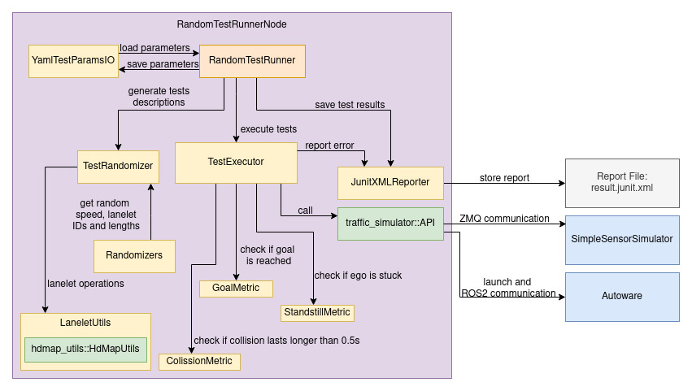
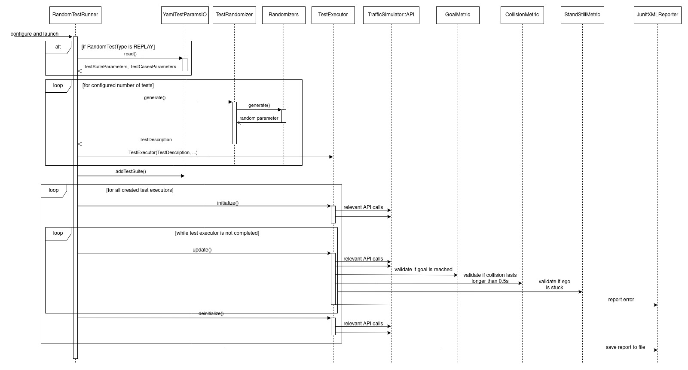

# Design

This section describes the details of `RandomTestRunner` implementation and behavior.

Before the simulation starts, `RandomTestRunner` creates multiple `TestExecutors` for every test it needs to perform. In order to create `TestExecutor` runner uses `TestRandomizer::generate` method which returns `TestDescription`. The description includes information about ego start and goal position as well as the information about npcs. This generated test description is passed to the `TestExecutor`. The generation process is done separately for each test executor.

In order to generate the test parameters `TestRandomizer` uses multiple `Randomizers`. It also uses `hdmap_utils::HdMapUtils` to operate on lanelets information.

After the generation `RandomTestRunner` keeps the vector of test executors and inside `RandomTestRunner::update` method it initialize and update the executors sequentially.

During the test `TestExecutor` uses the object of `JunitXmlReporter` class to report the errors. More detailed information about the kinds of reported error can be found in [Usage](Usage.md#result-junit-file).

`TestExecutor` uses `traffic_simulator::API` to update the state of the simulation and validate the metrics. Executor finishes the test if the goal is reached, an unexpected standstill is detected or the scheduled time for the test has expired.

After all the tests are finished `RandomTestRunner` calls `JUnitXMLReporter::write()` and information reported during the test is saved to the `report.junit.xml` file inside configured directory. The directory can be specified as `RandomTestRunner` ROS 2 parameter. To see the detailed description of the result file please see [Results](Usage.md#result-junit-file).

To better visualize how this module works please find the sequence diagram below:

