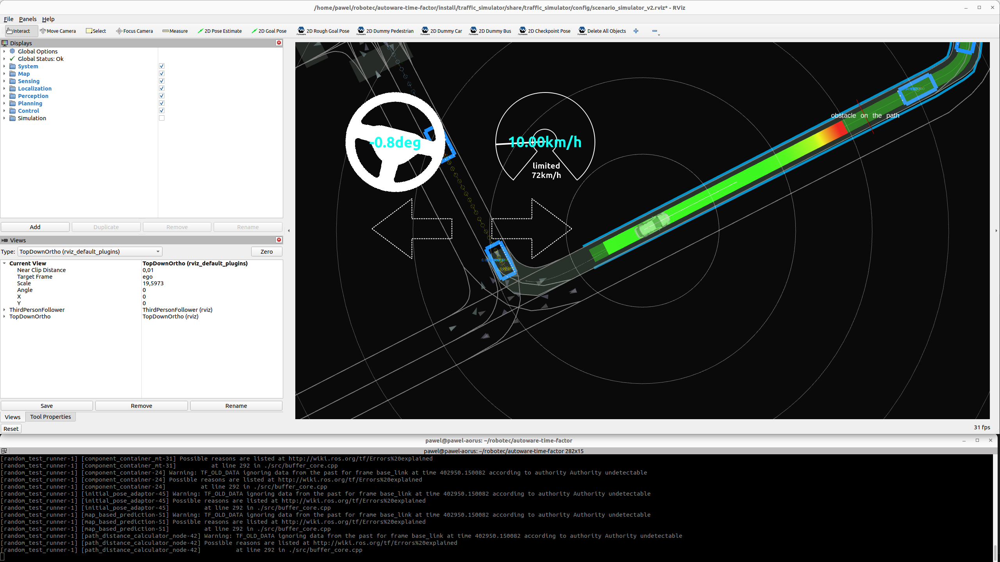
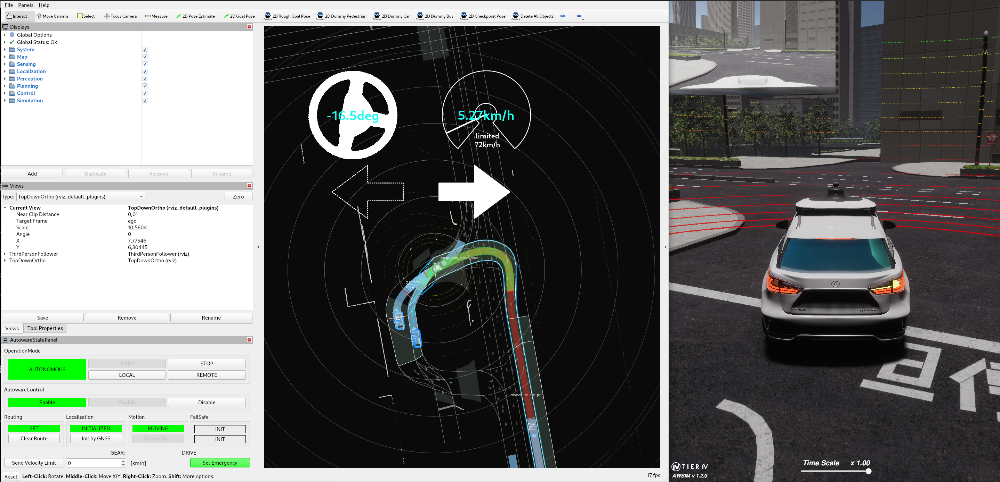

# Random test runner

Random test runner allows running randomly generated scenarios to test Autoware autonomy implementation. For more information regarding Random test runner features and limitations please see [Usage](Usage.md#features).

## How to build

1. Clone the Autoware Core/Universe repository and move to the directory:
   ```bash
   git clone git@github.com:autowarefoundation/autoware.git
   cd autoware 
   ```
2. Import Autoware and Simulator dependencies:
   ```bash
   mkdir src
   vcs import src < autoware.repos  
   vcs import src < simulator.repos
   ```
3. Install dependencies for Autoware Core/Universe
   ```bash
   ./setup-dev-env.sh
   ``` 
4. Install dependent ROS packages.
   ```bash
   source /opt/ros/humble/setup.bash
   rosdep install -iry --from-paths src --rosdistro $ROS_DISTRO
   ```
5. Build the workspace.
   ```bash
   colcon build --symlink-install --cmake-args -DCMAKE_BUILD_TYPE=Release
   ```

## How to run

First complete build described in [How to build](#how-to-build) section.


Being in the main project directory run:

```shell
source install/setup.bash
ros2 launch random_test_runner random_test.launch.py
```

Which will run random tests with default parameters. Similarly to the image below you should see several npcs spawned in random locations around the ego vehicle, which will move on random path following the goal.



Detailed description of the possible parameters can be found under [Parameters](Usage.md#launch-arguments).

## 

After test is completed see `/tmp` directory. Among others, there will be two files:
1. `result.junit.xml` - test result file with information about encountered errors.
2. `result.yaml` - yaml file that can be used to replay tests.

For the more specified information about output files please see [Results](Usage.md#results).

##

It might happen that the random test runner will behave unexpectedly and the test will not launch correctly. For further details regarding known issues please see [Troubleshooting](Usage.md#troubleshooting).

## How to replay

Prerequisites:
1. Build as instructed in [How to build](#how-to-build)
2. Acquire `result.yaml` file:
   1. Either by running test as stated in [How to run](#how-to-run) part of instruction.
   2. Receiving it from someone who already ran it.
3. Place `result.yaml` in `<some_directory>` IMPORTANT: Do not change filename.
4. Execute:
 
```shell
ros2 launch random_test_runner random_test.launch.py input_dir:=<some_directory>
```

Random test runner will load `result.yaml` file and rerun test.

## Running with unity

### Autoware build update

1. Clone RobotecAI's Autoware and move to the directory
   ```bash
   git clone git@github.com:RobotecAI/autoware-1.git
   cd autoware-1
   ```
2. Checkout the `awsim-ss2-stable` branch
   ```bash
   git checkout awsim-ss2-stable
   ```
3. Import Autoware and Simulator dependencies:
   ```bash
   mkdir src
   vcs import src < autoware.repos  
   vcs import src < simulator.repos
   ```
4. Install dependencies for Autoware Core/Universe
   ```bash
   ./setup-dev-env.sh
   ``` 
5. Install dependent ROS packages.
   ```bash
   source /opt/ros/humble/setup.bash
   rosdep install -iry --from-paths src --rosdistro $ROS_DISTRO
   ```
6. Download and extract [shinjuku_map.zip](https://github.com/tier4/AWSIM/releases/download/v1.2.0/shinjuku_map.zip) archive
   ```bash
   unzip <Download directory>/shinjuku_map.zip -d src/simulator
   ```
7. Build the solution
   ```bash
   colcon build --symlink-install --cmake-args -DCMAKE_BUILD_TYPE=Release
   ```
   
### Preparing Unity project

 Follow [Setup Unity Project tutorial](https://tier4.github.io/AWSIM/GettingStarted/SetupUnityProject/)

### Running the demo

1. Open AutowareSimulationScenarioSimulator.unity scene placed under `Assets/AWSIM/Scenes/Main` directory
2. Run the simulation by clicking `Play` button placed at the top section of Editor.
3. Launch `random_test_runner`.

```bash
ros2 launch random_test_runner random_test.launch.py map_name:=shinjuku_map simulator_type:=awsim \
npc_count:=5 initialize_duration:=260 sensor_model:=awsim_sensor_kit  vehicle_model:=sample_vehicle  \
autoware_launch_file:=e2e_simulator.launch.xml autoware_architecture:="awf/universe/20230906"
```



### Known issues
- Due to misalignment of lanelet and some parts of the AWSIM environment, Ego entity is being spawned below the terrain.
The misalignment will be fixed in a future version of the package.

- when the `npc_count` is too big the NPCs start to slide sideways and the localization does not work properly.
Reasons are yet unknown and more investigation should be conducted. It was determined that the working number of
NPCs is 5
