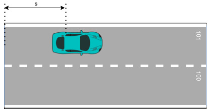

# Features

- Full and partial randomization of the Ego goal position for multiple test cases.

- NPCs customization:
  - number of NPCs
  - distance from the Ego
  - velocities of NPC vehicles in the simulation.

- Simulation related errors reporting:
  - Ego being found stuck in one place for too long.
  - Ego failing to reach the goal in a specified time.
  - Collision between Ego and NPC.

- Ego vehicle capabilities:
  - Goal following
  - Lane changing
  - Stopping precisely on a designated line
  - Yield at intersections

- NPCs possible actions:
  - Following the line.
  - Following another entity.

# Limitations

- Random test runner does not support traffic lights signalization.

- NPCs actions:
  - NPCs are not stopping to avoid collision when they are not following the colliding entity (eg. on the intersections).
  - NPCs are not able to yield at the intersection.


# Troubleshooting

There are two known issues which block random test runner from initializing the test if either initial position or goal pose exceeds the drivable area.

- If the initial position exceeds the drivable are: 

Autoware will be launched, but the ego vehicle will not move, waiting for Autoware to change its state to WaitingForEngage. After a timeout the test will terminate and the runner will continue with the next test.

After the test suite is completed, the `AutowareError` connected with the failed test will be logged to the `result.junit.xml` with the message: `Simulator waited for the Autoware state to transition to WaitingForEngage, but time is up. The current Autoware state is EMERGENCY.`

- If the generated goal pose exceeds the drivable ares: 

The test will be immediately stopped after launching the Autoware and similarly as in the first case the error will be logged and the runner will continue with the next test.

After the test suite is completed, the `scenario_simulator_error` connected with the failed test will be logged to the `result.junit.xml` with the message: `Requested the service "/api/routing/set_route_points" 1 times, but was not successful.`

# Launch arguments

This section describes arguments of the random test runner. All of them can be specified via command line, otherwise default value specified in the launch file is used. 

Parameters listed in [Node parameters](#node-parameters) section can be also specified in a yaml file which should be located in `<random_test_runner_directory>/param/`.

Parameters have the following source precedence priorities:
1. `*.yaml` file (applicable only for [Node parameters](#node-parameters))
2. Command line
3. Default values

## General arguments

| Parameter name               | Default value                 | Description                                                                                                                                                                                                                 |
|------------------------------|-------------------------------|-----------------------------------------------------------------------------------------------------------------------------------------------------------------------------------------------------------------------------|
| `test_parameters_filename`   |  `""`                         | Yaml filename within `random_test_runner/param` directory containing test parameters. Only [Node parameters](#node-parameters) can be specified in this file.                                                               |
| `simulator_type`             |  `"simple_sensor_simulator"`  | Backend simulator. Currently supported value is `simple_sensor_simulator`. It's also accepted by the node but should be supplied as direct launch argument.                                                              |
| `simulator_host`              | `"localhost"`                 | Simulation host. It can be either IP address or the host name that is resolvable in the environment (you can add a host by appending `"<SIMULATOR_IP> <SIMULATOR_NAME>"` line to the `/etc/hosts` file).                     |

## Autoware related arguments

Launch also accepts Autoware parameters that control Autoware related behavior. It can set which Autoware architecture is in use, which vehicle
and sensor model is used in the simulation

| Parameter name      | Default value                 | Description                                                               |
|---------------------|-------------------------------|---------------------------------------------------------------------------|
| `architecture_type` | `"awf/universe"`              | Autoware architecture type. Currently the only supported value is: `awf/universe`. |
| `sensor_model`      | `"sample_sensor_kit"`                   | Ego sensor model.                                                          |
| `vehicle_model`     | `"sample_vehicle"`                     | Ego vehicle model.                                                         |


## Node parameters

Random testing supports several parameters to control test execution. They can be supplied either directly from command 
line or via `*.yaml` file inside `<random_test_runner_directory>/param/`. Example of the yaml file specifying parameters can be found [here](#example-parameters-yaml-file).

### Parameters reference

Random test runner parameters are split into three categories:

1. [Test control parameters](#test-control-parameters)
2. [Test suite parameters](#test-suite-parameters)
3. [Test case parameters](#test-case-parameters)

### Test control parameters

High level parameters not directly related to the test itself

| Parameter name        | Default value               | Description                                                                                                           |
|-----------------------|-----------------------------|-----------------------------------------------------------------------------------------------------------------------|
| `input_dir`           | `""`                        | Directory containing the result.yaml file to be replayed. If not empty, tests will be replayed from result.yaml.      |
| `output_dir`          | `"/tmp"`                    | Directory in which result.yaml and result.junit.xml files will be placed after the test suite is executed.            |
| `test_count`          | `5`                         | Number of test cases to be performed in the test suite.                                                               |
| `test_timeout`        | `60.0`                      | Timeout of each random test.                                                                                          |
| `simulator_type`      | `"simple_sensor_simulator"` | Backend simulator. Currently supported value is `simple_sensor_simulator`. It should be set only via launch argument. |
| `initialize_duration` | `35`                        | How long test runner will wait for Autoware to initialize.                                                            |

### Test suite parameters

Core test parameters. It sets map name, ego goal information and npc spawning parameters.

| Parameter name                            | Default value       | Description                                                                                                                                                               |
|-------------------------------------------|---------------------|---------------------------------------------------------------------------------------------------------------------------------------------------------------------------|
| `test_name`                               | `"random_test"`     | Test name. Used for descriptive purposes only.                                                                                                                             |
| `map_name`                                | `"kashiwanoha_map"` | Name of the package containing map information. For more information please see [map package](Usage.md#map-package).                                                                                                    |
| `ego_goal_lanelet_id`                     | `-1`                | Goal lanelet's id. If `-1`, goal will be chosen randomly.                                                                                                |
| `ego_goal_s`                              | `0.0`               | Goal lanelet's translation along the lanelet in meters. For more detailed description please see [lanelets positioning](Usage.md#lanelets-positioning). If `ego_goal_lanelet_id` equals `-1`, s will be chosen randomly.                                               |
| `ego_goal_partial_randomization`          | `False`             | If `true`, goal will be randomized within distance set in `ego_goal_partial_randomization_distance` value. For more detailed description please see [lanelets positioning](Usage.md#lanelets-positioning). If `ego_goal_lanelet_id` is set to `-1`, this value is ignored. |
| `ego_goal_partial_randomization_distance` | `25.0`              | Distance in meters from goal set by `ego_goal_lanelet_id` and `ego_goal_s`, within which goal pose will be randomized if `ego_goal_partial_randomization` is set to true.  |
| `npc_count`                               | `10`                | Number of npcs which will be generated.                                                                                                                                                    |
| `npc_min_speed`                           | `0.5`               | Minimum speed of generated npcs                                                                                                                                           |
| `npc_max_speed`                           | `3.0`               | Maximum speed of generated npcs                                                                                                                                           |
| `npc_min_spawn_distance_from_ego`         | `10.0`              | Minimum distance of generated npcs from ego                                                                                                                               |
| `npc_max_spawn_distance_from_ego`         | `100.0`             | Maximum distance of generated npcs from ego                                                                                                                               |
#### Map package

Package containing map information. This package needs to be built in the Autoware workspace. Package example can be found [here](https://github.com/tier4/AWSIM/releases/download/v1.2.0/shinjuku_map.zip).

The structure of the package needs to be as follows:

- The root package directory, which contains:
  - `package.xml` file
  - `CMakeList.txt` file
  - map directory, which contains:
    - `.osm` file
    - `.pcd` file

#### Lanelets positioning

Lanelet position used to represent the ego goal includes two coordinate:
  - the ID of the lanelet on which the target is located,
  - the translation along the lanelet.

On the example below two connected lanelets with IDs 101 and 100 are presented. The translation s is the distance between lanelet's beginning and the vehicle's rear axle position.



### Test case parameters

Test case parameters. Currently, only randomization seed.

| Parameter name  | Default value | Description                                                       |
|-----------------|---------------|-------------------------------------------------------------------|
| `seed`          |   `-1`        | Randomization seed. If `-1`, seed will be generated for each test |

### Example parameters yaml file
```
/**:
  ros__parameters:
    # control parameters
    "output_dir": "/tmp"
    "input_dir": ""

    # test suite parameters
    "test_name": "random_test"
    "map_name": "kashiwanoha_map"
    "ego_goal_lanelet_id": 34600 # -1 means full goal randomization
    "ego_goal_s": 5.0
```

# Results

After the test suite execution two files can be found in the specified output folder.

## Result yaml file

Stores parameters used to generate the test suite. This file might be used to rerun the tests as described in [Replay](QuickStart.md#how-to-replay).

### Example `result.yaml`:
```yaml
random_test:
  name: video_test
  map_name: kashiwanoha_map
  ego_goal_s: 5.000000000000000000
  ego_goal_lanelet_id: -1
  ego_goal_partial_randomization: false
  ego_goal_partial_randomization_distance: 30
  npc_count: 10
  npc_min_speed: 0.500000000000000000
  npc_max_speed: 3.000000000000000000
  npc_min_spawn_distance_from_ego: 10.000000000000000000
  npc_max_spawn_distance_from_ego: 50.000000000000000000
  test_cases:
    - seed: 1281242544
    - seed: 3644198185
    - seed: 2673087374
    - seed: 1312244741
    - seed: 2518911638
```

## Result JUnit file

The file contains information about errors which occurred during test cases which were executed by the random test runner.

If the execution of the test finished with an error the stored information contains type of the error and the message describing the error.

There are 3 types of error reported, related directly to the simulation, which are:
1. `Stand still error` - reported when ego is found stuck in one place for too long.
2. `Timeout error` - reported when ego fails to reach the goal in a specified time.
3. `Collision error` - reported when collision between ego and npc appears,
4. Exceptions caught during the runtime which includes:
    - `AutowareError`, 
    - `scenario_simulator_exception`,
    - `std::runtime_error`.


If any other error occurs during the random test runner execution, it will be stored along with the information that the `Unknown Error` has occurred.

### Example `result.junit.xml`:
```xml
<?xml version="1.0"?>
<testsuites failures="0" errors="6" tests="5">
  <testsuite name="random_test" failures="0" errors="6" tests="5">
    <testcase name="4">
      <error type="stand still" message="Ego seems to be stuck" />
    </testcase>
    <testcase name="2">
      <error type="collision" message="npc2 and ego collided at 6.249999999999986s" />
      <error type="stand still" message="Ego seems to be stuck" />
    </testcase>
    <testcase name="3">
      <error type="collision" message="npc1 and ego collided at 17.25000000000011s" />
      <error type="timeout" message="Ego failed to reach goal within timeout" />
    </testcase>
    <testcase name="1">
      <error type="stand still" message="Ego seems to be stuck" />
    </testcase>
    <testcase name="0" />
  </testsuite>
</testsuites>
```
