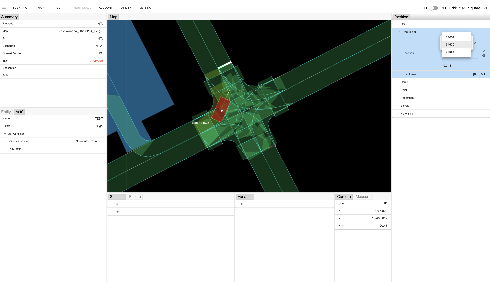

# Topic : Changing the coordinate system

## Displayed coordinate change

You can change a coordinate of the displayed object position by following steps.

When changing to the global coordinate:

1. "MAP" on the menu -> "Coordinate" -> Select "World"

When changing to the coordinate of the lane:

1. "MAP" on the menu -> "Coordinate" -> Select "Lane"

The position of the displayed object in "Position" on the right side of the screen will be changed to one corresponding to the selected coordinate.

## Lane select when lanes overlap

When you placed an object in a place where the lanes overlap on the lane coordinate, you can select an appropriate lane by following steps.

1. "MAP" on the menu -> "Coordinate" -> Select "Lane"
1. Place an object in the place the lanes overlap (e.g. intersection in a below figure).
1. Click "position" row in "Position" window on the right side of the screen.
1. Click a pencil icon on the right side of "lane" field.
1. Select an appropriate lane from a selectable lane list.
1. Click a check mark icon at the far right in "position" row.

