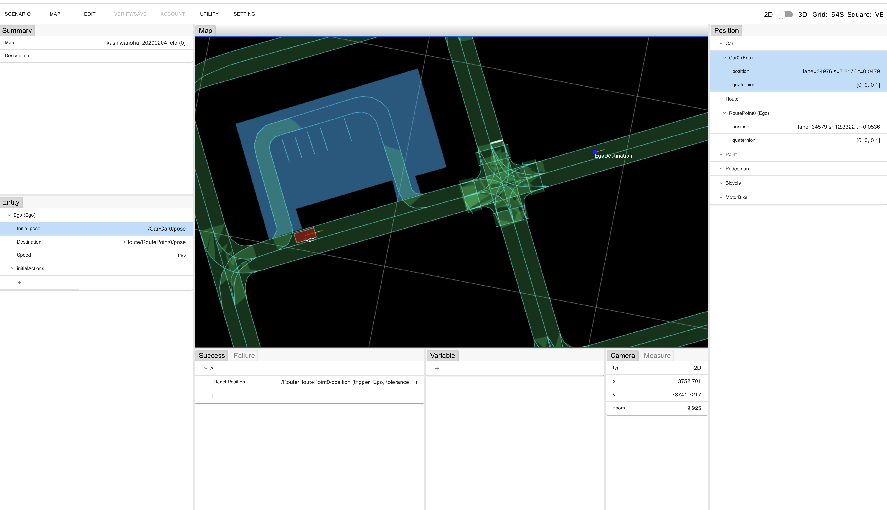
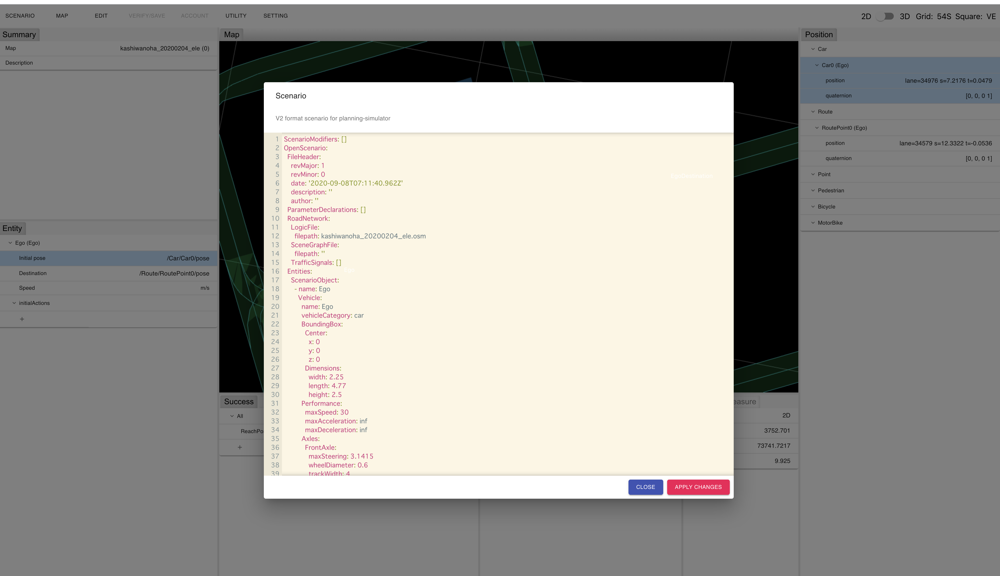

# Create a simple scenario

## Launch a scenario editor and open a map

You can launch a scenario editor and open a map by following steps.

1. Open https://scenario.tier4.jp/scenario_editor/restricted/ on Google Chrome
1. "MAP" on the menu -> Select "Load map"
1. Select .osm file (Lanelet2) and click "Import" button

The map opens and you can see a screen like a following figure.

You can zoom in/out with mouse wheel on the map, move the map by dragging with right mouse button, and rotate the map by dragging with left mouse button. 

## Place Ego car

You can place Ego car and set the destination on the map by following steps.

1. "EDIT" on the menu -> "Ego" -> Select "Set ego car"
2. Click where you would like to place Ego car on the lane in the map.
3. "EDIT" on the menu -> "Ego" -> Select "Set ego car destination"
4. Click where you would like to set as a destination of Ego car on the lane in the map.

Objects which show Ego car and the destination are displayed on the map like a following figure.

You can see that a condition to judge if Ego car arrived at the destination as a success criteria is added in "Success" window on the bottom of the screen.

## Velocity designation of Ego car

You can designate the target velocity of Ego car by following steps.

1. Click "Speed" in "Entity" window on the bottom left of the screen.
2. Input the velocity value (m/s) in the form.
3. Click the check mark icon on the right side of the form.

## Display a scenario

You can see a scenario under editing as a text by following steps.

1. "SCENARIO" on the manu -> Select "Open text editor"

A window like a following figure is shown and the scenario is displayed as a text.

## Export a scenario

You can export a scenario file by following steps.

1. "SCENARIO" on the menu -> Select "Export"
2. Input a name of the export file in the dialog box.
3. Click "Export"　button.

The scenario is exported as a file. You can execute a simulator using the file.

Do not forget!! : Please export scenario in Tier4 format V2.
