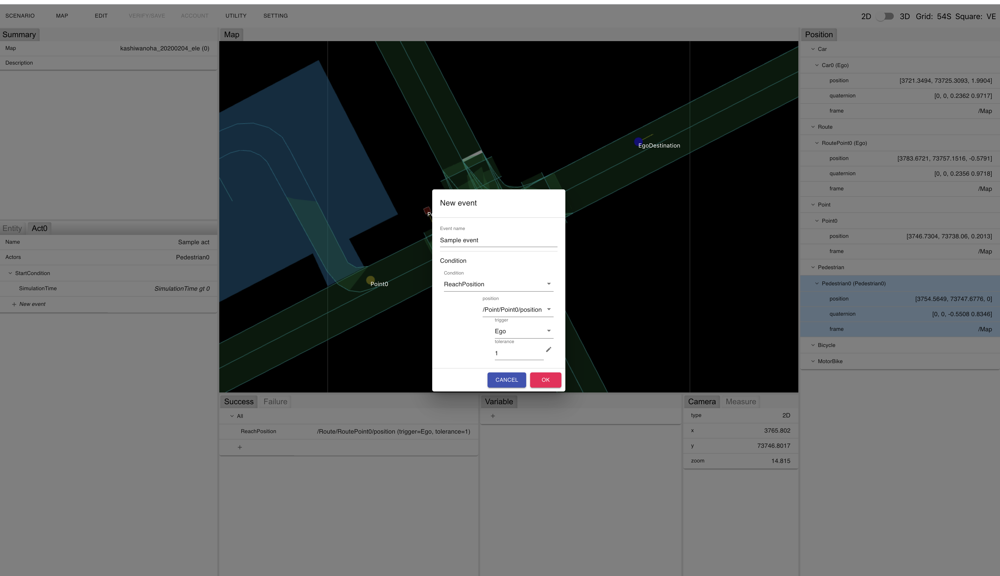

# Edit an existing scenario

Please go to following steps after completing [Create a simple scenario](CreateSimpleScenario 'CreateSimpleScenario').

## Load a scenario

You can load a scenario exported at [Create a simple scenario](CreateSimpleScenario 'CreateSimpleScenario') by following steps after launching scenario editor and opening a map.

1. "SCENARIO" on the menu -> Select "Import yaml"
2. Select a scenario file from a displayed dialog.
3. Click "IMPORT" button.

After loading, the scenario contents are displayed.

## Add a Pedestrian

You can add a Pedestrian in a scenario by following steps.

1. "EDIT" on the menu -> "Pedestrian" -> Select "Add pedestrian"
2. Click where you would like to add a pedestrian on the map.
3. Adjust the pedestrian direction by dragging an arrow of the pedestrian object on the map.
4. As same as "Velocity designation of Ego car" in [Create a simple map](CreateSimpleScenario 'CreateSimpleScenario'), designate the velocity of the pedestrian. As an example, set 0 m/s not to walk in an initial state.

In the figure above, you can see that the pedestrian is placed in front of a crosswalk, faces toward the crosswalk and a pedestrian's target velocity is set at 0 m/s. 

## Add a Point

You can add a Point (an object to indicate　a place on the map) used for a starting condition of Event by following steps.

1. "EDIT" on the menu -> "Point" -> Select "Add point"
2. Click a point on the way from the initial position of Ego car to the destination.

A new object is placed on the place where you clicked.

## Add an Act

You can add an Act which describes a motion of the pedestrian by following steps.

1. "SCENARIO" on the menu -> Select "Add new act"
2. Input data in the displayed dialog. (Refer the figure below.)
   - Input "Sample act" in "Act name"
   - Select "Pedestrian0" in "Actors"
   - Select "SimulationTime" in "Condition"
   - Select "gt" in "Rule" and input "0" in ”Value"
3. Click "OK" button.

A new act is added and "Act0" tab is displayed in the bottom left window.

## Add an Event

You can add an Event which describes a condition of the pedestrian's motion start by following steps.

1. Click "Act0" tab in the bottom left window.
2. Click "+" icon on the left of the "New event".
3. Input data in the displayed dialog. (Refer the figure below.)
   - Input ”Sample event" in "Event name"
   - Select "ReachPosition" in "Condition"
   - Select "/Point/Point0/position" in ”Position", "Ego" in "Trigger" and input 1 in "Tolerance".
4. Click "OK" button.

## Add an Action

You can add an Action which changes the velocity of the pedestrian by following steps.

1. Click "Act0" tab in the bottom left window.
2. Click "+" icon on the left of the ”New action".
3. Input data in the displayed dialog. (Refer the figure below.)
   - Select "Speed" in "Action"
   - Input 1 in "Value"
4. Click "OK" button.

## Export a scenario

You can export a scenario file by following steps.

1. "SCENARIO" on the menu -> Select "Export"
2. Input a name of the export file in the dialog box.
3. Click "Export"　button.

The edited scenario is exported as a file. You can execute a simulator using the file.

Do not forget!! : Please export scenario in Tier4 format V2.
