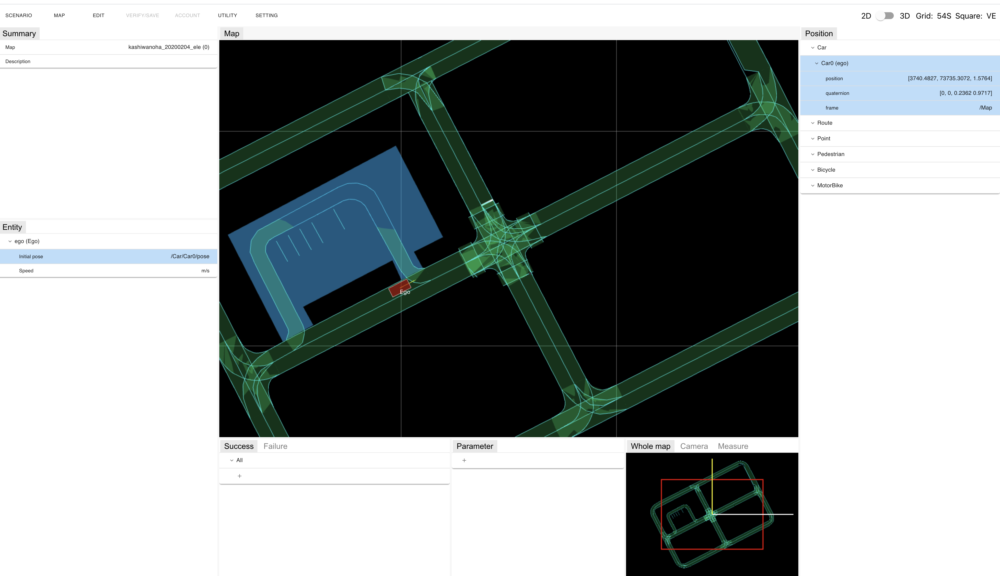
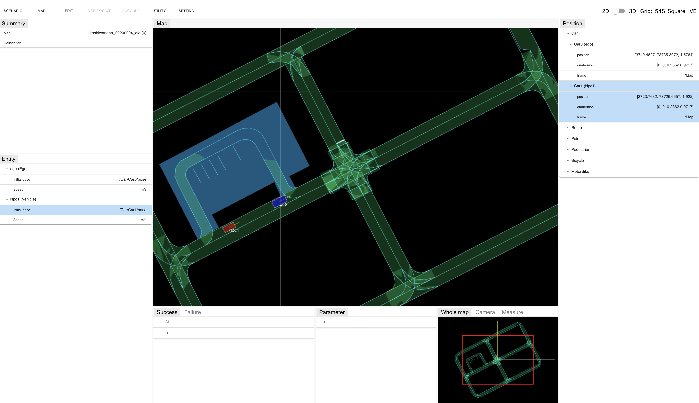
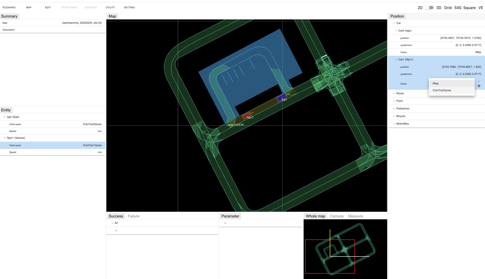
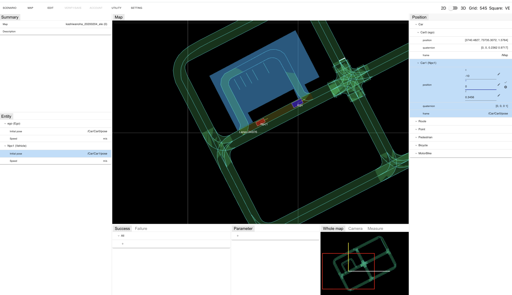
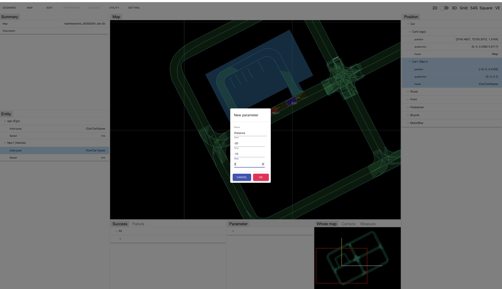
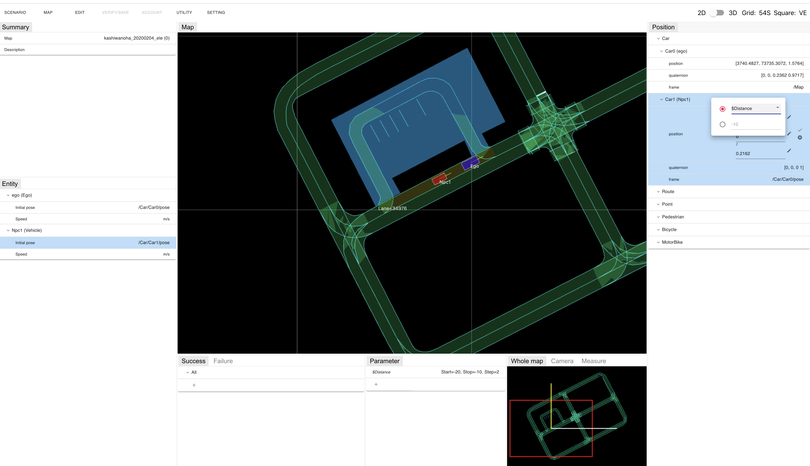
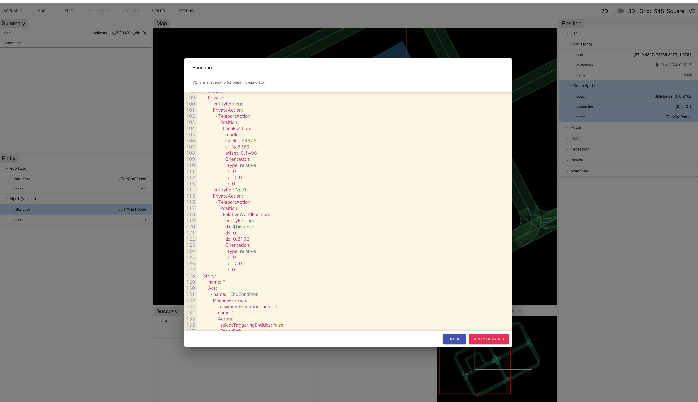

### Topic : Placing Entity at Relative Position

#### Launch scenario editor and open map

You can launch a scenario editor and open a map by following steps.

1. Open https://scenario.tier4.jp/scenario\_editor/restricted/ on Google Chrome
1. "MAP" on the menu -> Select "Load map"
1. Select .osm file (Lanelet2) and click "Import" button

The map opens and you can see a screen like a following figure.

#### Place Ego car

You can place Ego car on the map by following steps.

1. "EDIT" on the menu -> "Ego" -> Select "Set ego car"
2. Click where you would like to place Ego car on the lane on the map.

#### Place NPC

You can place NPC on the map by following steps.

1. "EDIT" on the menu -> "NPC" -> Select "Add NPC"
2. Click on the backward position of the Ego car

#### Set the NPC's position relative to the Ego car

You can set the position of the NPC relative to the Ego car by following steps.

1. Click on the "frame" row of "Car1 (Npc1)" in "Position" on the right side of the screen
2. Select "/Car/Car0/pose" from the drop-down list and click the check mark icon on the right side of the form

3. Click on the "position" row of "Car1 (Npc1)" in "Position" on the right side of the screen
4. Enter a value of "-10" for "x" and "0" for "y" and click the check mark icon on the right side of the form

The NPC position is set to 10 meters behind the Ego car.

#### Set the position of the NPC with a parameter

You can set the position of the NPC with a parameter by following steps.

1. Click "+" icon in "Parameter" on the bottom side of the screen.
2. Input data in the displayed dialog. (Refer the figure below.)
   - Input "Distance" in "Name"
   - Input -20 in "Start"
   - Input -10 in "Stop"
   - Input 2 in "Step"
3. Click "OK" button.

4. Click on the "position" row of "Car1 (Npc1)" in "Position" on the right side of the screen
5. Click on the pencil icon to the right of the "x"
6. Select the radio button on the top of the input component that appears
7. Select "$Distance" from the drop-down list
8. Click check the check mark icon on the right side of the form

9.  "Scenario" on the menu -> Select "Open text editor"

A window like a following figure is shown and the scenario is displayed as a text.

You can see that the position of Npc1 is set using the element "RelativeWorldPosition" in the text "StoryBoard" -> "Init" -> "Actions" -> "Private".

If it is not working properly, you may be using an old Scenario editor, please super-reload your browser and try again.
