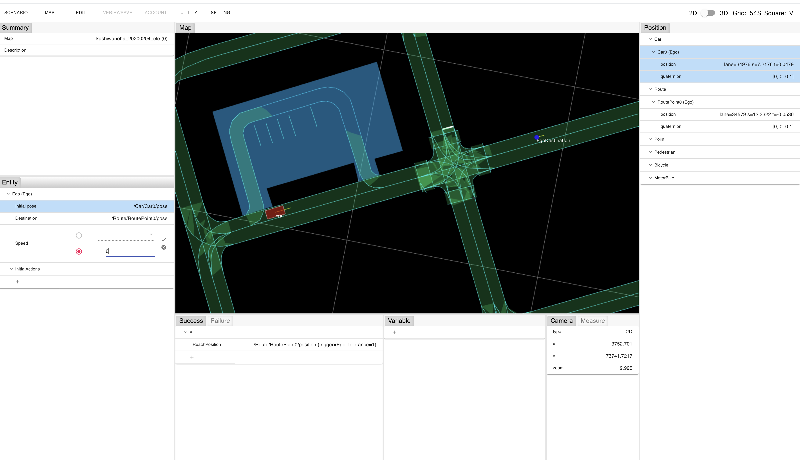

# Scenario Editor User Guide

You can access via this [URL](https://scenario.ci.tier4.jp/scenario_editor/).
Note! Scenario editor only supports [Google Chrome. :fa-chrome:](https://www.google.com/intl/ja_jp/chrome/)
The latest version of Google Chrome (Currently, [google chrome 86](https://developers.google.com/web/updates/2020/10/nic86)) is recommended.

If you want to know how to create and edit scenario in scenario editor, please read [Web.Auto official documentation.](https://docs.web.auto/en/user-manuals/scenario-editor/introduction)
