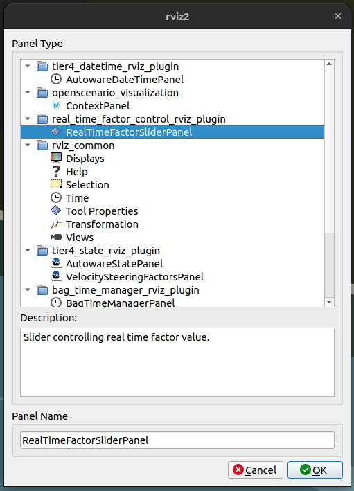
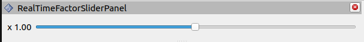

# How to use realtime factor

It is possible to modify the speed of simulation (the speed of time published on the /clock topic is not affected):

- from the start of the simulation (using parameter),
- during the simulation (using the GUI slider).

## Use parameter

 - When you run simulations on the command line, add an `global_real_time_factor`  parameter with a custom value (the default is 1.0). 

   ```bash
   ros2 launch scenario_test_runner scenario_test_runner.launch.py \
   architecture_type:=awf/universe/20230906 \
   record:=false \
   scenario:='$(find-pkg-share scenario_test_runner)/scenario/sample.yaml' \
   sensor_model:=sample_sensor_kit \
   vehicle_model:=sample_vehicle \
   global_real_time_factor:="0.5"
   ``` 

 - The smaller the value you specify, the slower the simulation will progress.

## Use slider on run time 

- When the simulation is started you can add the `RViz` panel by clicking `Panels -> Add new panel` in the top left corner of RViz.

- Then in the pop up window please select `RealTimeFactorSliderPanel` and double click on it.



- Slider controlling the speed of simulation time should be visible on the left side of the screen.



- The process of adding the panel is also visible in the video:

<video width="1080" controls muted>
    <source src="/image/realtime_factor/video.mp4" type="video/mp4">
</video>


## Configure `use_sim_time` parameter

Parameter `use_sim_time` of `openscenario_interpreter` is **false** by default and can be modified by passing it using command line.


   ```bash
   ros2 launch scenario_test_runner scenario_test_runner.launch.py \
   architecture_type:=awf/universe/20230906 \
   record:=false \
   scenario:='$(find-pkg-share scenario_test_runner)/scenario/sample.yaml' \
   sensor_model:=sample_sensor_kit \
   vehicle_model:=sample_vehicle \
   global_real_time_factor:="0.5" \
   use_sim_time:=true
   ``` 

However, this impacts the time published on the `/clock` topic and the time used by `Autoware`.
Details are shown in the table below:

| use_sim_time launch parameter | /clock time published by scenario_simulator_v2 | AWF Autoware Time      |
| ----------------------------- | ---------------------------------------------- | ---------------------- |
| false (default)               | walltime                                       | walltime from /clock   |
| true                          | simulation                                     | simulation from /clock |

Below are also some bullet points explaining the impact of the `use_sim_time` parameter on `scenario_simulator_v2` and `Autoware`:

 - **`use_sim_time:=True` passed using command line**
    - Both Autoware and scenario_simulator_v2 are launched with `use_sim_time=true`. 
    - Time published on `/clock` is the **simulation time** (starting from 0). 
    - Time published on `/clock` **can be** controlled by RViz plugin. 
    - Simulation time **can be** controlled by RViz plugin.
 - **`use_sim_time:=False` passed using command line (default value)**
     - Both Autoware and scenario_simulator_v2 are launched with `use_sim_time=false`. 
     - Time published on `/clock` is the **walltime**. 
     - Time published on `/clock` **cannot be** controlled by RViz plugin. 
     - Simulation time **can be** controlled by RViz plugin.
